---
stepsCompleted:
  - 1
  - 2
  - 3
  - 4
  - 5
  - 6
  - 7
  - 8
  - 9
  - 10
  - 11
  - 12
  - 13
  - 14
inputDocuments:
  - _bmad-output/planning-artifacts/product-brief-vibe_visualiser-2026-03-06.md
  - _bmad-output/planning-artifacts/prd.md
  - _bmad-output/planning-artifacts/prd-validation-report.md
  - docs/bmad-toad-integration-spec.md
date: 2026-03-08
author: Linus
---

# UX Design Specification vibe_visualiser

**Author:** Linus
**Date:** 2026-03-08

---

<!-- UX design content will be appended sequentially through collaborative workflow steps -->

## Executive Summary

### Project Vision

Vibe Visualiser is a browser-served guided experience that democratises the BMAD methodology by providing a conversational, agent-driven interface where users progress through structured planning phases — Analysis, Planning, Solutioning, Implementation — producing Obsidian-native markdown artifacts. Built on the Toad UI framework (Textual Web), the entire experience runs in the browser via `make start`, with a Git-backed state engine and SQLite index hidden behind a "time travel" mental model. Users never see a terminal, a Git command, or a branch name.

### Target Users

**Sarah — Non-Technical Planner (Primary UX Filter):** Project manager who needs rigorous planning without methodology overhead. Zero terminal experience. Entry via GitHub Codespaces one-click setup. Values guided hand-holding, Party Mode stress-testing, and the peace of mind that every decision is traceable. Every UX decision must pass the "Does Sarah understand this without help?" test.

**Alex — Technical Builder:** Developer who skips planning and pays for it later. Wants a fast, efficient path from idea to actionable backlog. Responds tersely — expects the agent to adapt pacing. Values artifact traceability and structured output he can act on immediately.

**Kai — Obsidian Knowledge Worker:** Product strategist with an elaborate vault. Every tool must integrate with Obsidian or it's rejected. Bind-mounts their existing vault. Values wikilink generation referencing existing notes, graph-view-optimised output, and bidirectional file ingestion.

**River — Creative Professional (Post-MVP):** Brand strategist with no software background. Enters via "Launch a creative session" — no phase-gates, no methodology jargon. Uses CIS brainstorming and design thinking tools. Potential upgrade path to full BMAD over time.

### Key Design Challenges

1. **Complexity abstraction:** Git state engine, SQLite index, multi-agent orchestration, and branching version history must be entirely invisible. "Time travel" navigation, stale detection, and version preservation must feel intuitive — not magical or confusing.

2. **Rich/Textual design constraint:** The UI is built on Textual (Rich rendering). This provides a strong component library (Panel, Tree, Table, Markdown, Rule, etc.) with full colour support — but it is still a character-grid renderer, not a DOM. All UX design must map to Rich/Textual primitives. The design system vocabulary IS the component catalogue.

3. **Four personas, one interface:** Guided hand-holding (Sarah), speed (Alex), vault integration (Kai), and creative freedom (River) must coexist. The three-mode welcome screen splits entry points, but in-workflow adaptation happens through agent behaviour and progressive disclosure — not modal UI complexity.

4. **Conversational UI as primary interaction:** Orientation is critical — where am I, what's decided, what's next. The Journey Map sidebar serves as the persistent spatial anchor. Conversation landmarks (visual dividers at topic transitions) provide micro-orientation within phases.

5. **Multi-agent visual identity:** Party Mode invokes multiple agents mid-workflow. Each agent rendered in a Rich `Panel` with coloured border, emoji icon, and name. 6-8 high-contrast colour slots assigned per-session. Facilitator voice visually distinct (dim/borderless). Discussion must remain scannable and exit back to guided flow must preserve state.

6. **Information density budget:** ~30 char sidebar + ~70-90 char main panel in a browser. Design must account for tight spatial constraints with clear rules for what's always visible, on-demand, and contextual.

7. **Session fatigue over 2-3 hour sessions:** Sustained engagement requires pacing variation, momentum indicators, and tangible output moments at regular intervals.

### Design Opportunities

1. **Journey Map as signature interaction:** Implemented as a Textual `Tree` widget with native expand/collapse, clickable nodes, state-driven icons (✅ completed, 🔵 in-progress, 🔒 locked), and guide lines. Progressive disclosure: zoomed-out phases, zoomed-in checkpoints, version forks. This is the product's visual identity.

2. **Real-time artifact emergence with inline preview:** The "conversation IS documentation" loop — users converse while structured artifacts appear in their Obsidian vault. Rich `Panel` + `Markdown` widget provides truncated inline preview at phase completion, closing the feedback loop within the UI.

3. **Adaptive pacing as core UX principle:** The agent adjusts depth based on user response patterns — not just a feature, but a design philosophy. Sarah feels guided, Alex feels efficient, same interface.

4. **Error states as trust-builders:** Warm, recoverable, progress-preserving error messages framed in Rich `Panel(border_style="red")`. "Connection lost — your progress is saved, click to retry" builds more trust than any feature.

5. **Agent as notification system:** Stale warnings, status updates, and contextual nudges delivered conversationally by the agent rather than via modal pop-ups. How a human collaborator would tell you, not how software would alert you.

### Core UX Principles (from Party Mode Discovery)

1. **Sarah-first decision filter:** Every UX choice filtered through "Does Sarah understand this without help?"

2. **Five-layer progressive disclosure model:**
   - Layer 1 (Welcome): Hides methodology — "Start a project" or "Resume"
   - Layer 2 (Phases): Hides workflows — "Analysis → Planning → Solutioning"
   - Layer 3 (Workflow): Hides step mechanics — conversational agent interaction
   - Layer 4 (Journey Map): Hides Git — "your decisions over time"
   - Layer 5 (Errors): Hides infrastructure — "saved, click to retry"

3. **Modal restraint:** Modals only for irreversible actions (creating a new version, archiving a project). Everything else is inline notifications or conversational.

4. **Text input as focus king:** Modifier-key shortcuts only; text area always default focus; no single-key shortcuts during typing.

5. **Engagement cadence:** Tangible output moment every 10-15 minutes (conversation landmark, artifact preview, or Journey Map update).

6. **Three-tier visual hierarchy:**
   - Heavy: Phase completion banners (Rich `Rule` + `Panel`)
   - Medium: Topic transition landmarks (Rich `Rule(style="dim")`)
   - Light: Normal conversation text

7. **Agent-to-UI event protocol:** Agent emits structured markers (landmarks, previews, map updates) that the UI renders as Rich components.

### Rich Component Design System

| Component | Rich/Textual Primitive | Use Case |
|-----------|----------------------|----------|
| Journey Map | `Tree` widget | Phase/checkpoint navigation with expand/collapse |
| Agent messages (Party Mode) | `Panel` with coloured border | Per-agent visual identity, 6-8 colour slots |
| Facilitator voice | Dim/italic borderless text | Meta-level guidance distinct from agents |
| Phase completion | `Rule` + `Panel` | Ceremony banners in conversation stream |
| Topic transitions | `Rule(style="dim")` | Lightweight conversation landmarks |
| Artifact preview | `Panel` + `Markdown` widget | Inline truncated preview of generated docs |
| Stale indicators | `Text(style="yellow")` | Warning badges on Journey Map nodes |
| Error states | `Panel(border_style="red")` | Warm, framed, recoverable error messages |
| Welcome screen | `Button` grid / `Placeholder` | Three-mode entry (guided, creative, resume) |
| Status bar | `Header` / `Footer` | Always-visible project name + current phase |
| Confirmation dialogs | `ModalScreen` | Irreversible actions only |
| Decision counter | `Footer` or sidebar element | Momentum indicator: "12 decisions captured" |

### UI Modes

| Mode | Layout | Visible Elements |
|------|--------|-----------------|
| Welcome | Full-width, no sidebar | Project list, three entry buttons |
| Guided Conversation | Sidebar + main panel | Journey Map, conversation, input area, status bar |
| Party Mode | Sidebar + main panel | Journey Map, agent roster indicator, coloured agent panels, input area |
| Version Review | Modal over conversation | Confirmation dialog, before/after context |
| Artifact Review | Inline in conversation | Rich Panel + Markdown preview of generated artifact |

### Spatial Layout Contract

- **Always visible:** Project name, current phase label, Journey Map (collapsed to phase-level by default)
- **On-demand:** Expanded Journey Map (click to drill into checkpoints), settings, health check
- **Contextual:** Artifact preview (at phase completion), stale warnings (when relevant), Party Mode agent roster (during Party Mode only)

## Core User Experience

### Defining Experience

The defining experience of Vibe Visualiser is the **artifact emergence moment** — the instant a user sees a structured, professional document appear in their Obsidian vault as a direct result of conversation. This is the "conversation IS documentation" promise made tangible. The user talks, the agent listens, and a real file appears in a real folder on their real filesystem. Everything else — the Journey Map, Party Mode, adaptive pacing — exists to support and amplify this core loop.

The core interaction cycle:
1. User converses with agent (guided questions, natural discussion)
2. Agent synthesises responses into structured content
3. Artifact appears in the configured vault location — visible in Obsidian immediately
4. User sees the artifact preview inline in the conversation (Rich `Panel` + `Markdown`)
5. User confirms, refines, or continues to the next topic

This cycle repeats at multiple scales: micro (a section of a document), medium (a complete artifact like a Product Brief), and macro (an entire phase completion). At every scale, the output is real, persistent, and in the right place.

### Platform Strategy

**Primary deployment: Local Docker Desktop with Dev Container.** This is where most users will run Vibe Visualiser. The bind mount connects the container to the user's local filesystem, placing artifacts directly into their Obsidian vault.

**Platform matrix:**

| Platform | Vault Location | Bind Mount Path | Setup |
|----------|---------------|-----------------|-------|
| macOS (Docker Desktop) | User's Obsidian vault | Configured in `devcontainer.json` | `make start` |
| Windows (Docker Desktop) | User's Obsidian vault | WSL/VirtioFS path mapping (translated for user display) | `make start` |
| Linux (Docker native) | User's Obsidian vault | Direct bind mount | `make start` |
| GitHub Codespaces | `_bmad-output/` in workspace | No bind mount — container-local | One-click launch |

**Dual configuration model:**
- **Pre-launch (devcontainer level):** Vault path set in `devcontainer.json` bind mount configuration before the container starts. This is where the actual filesystem mapping happens.
- **Runtime (Toad UI):** Settings UI allows verification and display of the mapped vault path. Users see their host-side OS-native path, never container-internal paths.

**Codespaces-aware messaging:** System detects Codespaces environment and adjusts messaging: "You're running in Codespaces. Artifacts are saved to your workspace. You can download them or connect a vault when running locally."

**Browser requirements:** Desktop browser at localhost:8000 via `toad serve`. Minimum window: 120 columns x 40 rows equivalent. Mobile/tablet not supported — desktop-first, keyboard-and-mouse interaction model.

### Vault Trust Model

Trust is the foundation of the entire user experience. Users must feel confident their work is being saved correctly, in the right place, on their actual filesystem, at all times.

#### First-Run Vault Validation (Human-in-the-Loop)

Before any workflow begins, the system validates the vault connection with user confirmation:

1. System detects first run (no existing projects)
2. Displays the configured vault path in the user's OS-native format
3. Writes a test file (`vibe-test.md`) to the vault
4. Asks the user: "I've saved a test file to `[host-path]/vibe-test.md`. Can you see it in Obsidian? (yes/no)"
5. User confirms the file appeared — closing the trust loop with human verification
6. System removes the test file and proceeds to the welcome screen

This human-in-the-loop validation is essential because the container cannot verify that Obsidian (a separate host application) has picked up the file. Only the user can confirm the full chain works.

#### Vault Status Indicator

A persistent status element in the `Header` or `Footer` displays vault health at all times:

```
📂 ~/ObsidianVault/Projects/acme/ ✓ · Saved 2 min ago
```

Status states:
- **Green checkmark + time since last save:** Vault path verified and writable, recent save confirmed
- **Yellow warning:** Vault path exists but last write was >5 minutes ago (gentle prompt to checkpoint)
- **Red alert:** Vault path unreachable — triggers recovery guidance

The "Saved X min ago" timestamp updates on every commit (auto-save or intentional checkpoint), providing continuous passive reassurance.

#### Host-Path Display Rule

The UI must never display container-internal paths. All path references are translated to the user's host OS format:
- macOS/Linux: Display the actual host mount path
- Windows: Display the Windows-native path (e.g., `C:\Users\Sarah\Documents\ObsidianVault\`), not the Docker-internal `/mnt/c/...` equivalent

#### Eight Trust Checkpoints

| Moment | Sarah's Question | UI Response |
|--------|-----------------|-------------|
| First run | "Where will my files be saved?" | Vault path in her OS format + test file confirmation |
| First run confirmed | "Did it actually work?" | She checks Obsidian, sees the file, confirms in the UI |
| During session | "Is my work being captured?" | Inline artifact preview + vault status indicator |
| Mid-session pause | "What if I close the browser?" | "Saved 2 min ago" indicator; auto-save guarantees max 2 min loss |
| Container crash | "What if something goes wrong?" | Recovery message: "All auto-saved work is preserved. Last save: [time]" |
| Returning to project | "Is my old work still there?" | Welcome screen shows project with status and last-active date |
| Resuming conversation | "Does it remember what we discussed?" | Agent greets with context summary from commit history |
| Revising past work | "Will I lose my current progress?" | Confirmation modal: "Your current work is saved. You can always come back." |

### Auto-Save Mechanism

**AI-powered auto-save** runs as a background process during active sessions:

1. Timer fires every 2 minutes
2. Stages all workspace changes (`git add .`)
3. If changes exist, generates a commit message by piping the diff to a Haiku-tier agent model
4. Commits with a `[session-auto]` marker prefix
5. Falls back to timestamp message (`auto-save {ISO timestamp}`) if the AI model is unreachable
6. Skips silently if no changes detected
7. File lock prevents collision with intentional checkpoint commits

**Two-tier commit model:**

| Tier | Trigger | Message | Journey Map | Purpose |
|------|---------|---------|-------------|---------|
| Auto-save | Every 2 minutes | AI-generated from diff, `[session-auto]` prefix | Filtered out | Safety net — max 2 min data loss |
| Intentional checkpoint | Phase completion or user-requested | Structured metadata (discussion summary, decisions, next topic) | Displayed as nodes | Semantic milestones — Journey Map entries |

Auto-save commits provide recovery context: the AI-generated messages describe what changed, enabling the agent to reconstruct conversational context from commit history during recovery.

Agent-suggested named checkpoints are **pacing devices, not safety devices.** The auto-save handles data protection. The agent suggests checkpoints for section closure: "We've covered user personas and success metrics. Want to save a named checkpoint before we move to functional requirements?" This creates natural breathing room in long sessions.

### Effortless Interactions

**Artifact emergence (the "wow" moment):** When a phase completes or a significant artifact is generated, it appears in the user's Obsidian vault with zero user action. No "save" button, no "export" step. The file is simply there — with frontmatter, wikilinks, and proper structure. The inline preview confirms it within the conversation UI. The user opens Obsidian and sees it in their graph view.

**Context recall on resume:** When Sarah returns after days away, the agent reconstructs context from Git commit metadata (both auto-save and intentional checkpoint messages) and greets her with a summary of where she left off. No "where was I?" moment.

**Bidirectional file ingestion:** Users drop markdown files into the project folder. The agent picks them up automatically in the next interaction. No upload button, no import wizard.

### Critical Success Moments

**Moment 1 — First-run vault validation (0-2 minutes):**
Sarah's first interaction is confirming where her files will be saved. She sees a path she recognises, confirms the test file appeared in Obsidian, and the vault indicator turns green. If this feels clear and trustworthy, she relaxes into the experience.

**Moment 2 — First artifact emergence (10-15 minutes):**
Sarah finishes discussing her project vision. The agent generates the first section of her Product Brief. The inline preview appears. She opens Obsidian — and the file is there, formatted, with frontmatter. This is the "aha" moment.

**Moment 3 — First Journey Map progression (30-45 minutes):**
Sarah completes the Analysis phase. The phase completion banner appears. The Journey Map updates — Analysis shows ✅, Planning unlocks. She sees her progress visualised and feels momentum.

**Moment 4 — First click-back (session 2 or later):**
Sarah clicks a completed node in the Journey Map to revise a past decision. The confirmation modal explains what will happen in plain language. She revises, sees the stale indicator downstream, and trusts the system to protect her work.

### Experience Principles

1. **Your work is always where you expect it.** Artifacts appear in the configured vault path, confirmed by a persistent indicator. Auto-save ensures no more than 2 minutes of work is ever at risk. No ambiguity about where data lives.

2. **Conversation produces real output.** Every meaningful conversation segment results in a tangible artifact or artifact update in the vault. The gap between "talking about it" and "having a document" is zero.

3. **Progress is visible and cumulative.** The Journey Map, decision counter, and phase completion ceremonies create continuous evidence of forward motion. Long sessions feel productive, not exhausting.

4. **The system remembers so you don't have to.** Context recall on resume, decision traceability via Journey Map, and artifact interlinking via wikilinks mean users never lose the thread of their work.

5. **Complexity is hidden until you need it.** Five-layer progressive disclosure ensures each user sees only the abstraction level relevant to them. Sarah sees guided conversations; the Git state engine and auto-save run silently underneath.

## Desired Emotional Response

### Primary Emotional Goals

**Control** is the dominant emotion — experienced as agency, not just button-clicking. At every moment, the user must feel they are driving the process and that their choices visibly shape the output. The artifacts must be *different* because of what the user said. The system guides, suggests, and facilitates, but never dictates. The agent asks questions; the user decides. The Journey Map shows where they are; the user chooses where to go. Control means no surprises, no hidden actions, no "the system did something I didn't ask for."

**Pride in output** is the reward. When Sarah finishes a phase and sees a professional, structured document in her Obsidian vault, she feels ownership. "I produced this." The user's voice must be audible in the final document — their words and decisions preserved, structured and polished but not replaced. The agent facilitates; the ideas belong to the user. This pride is what makes her show it to a colleague.

**Trust in the system** is the safety net. "It remembers everything." Every decision preserved, every session recoverable, every revision traceable. Trust isn't a feature — it's the absence of anxiety. The system earns trust through consistent, visible reliability: the vault indicator, the auto-save timestamp, the context recall on resume.

**Energy** is the session aftertaste. Users close the browser feeling "I finished something meaningful AND there's exciting work ahead." Sessions end with narrative closure on completed work and an open thread for next time.

### Emotional Journey Mapping

| Stage | Target Emotion | UX Mechanism |
|-------|---------------|--------------|
| **First launch** | Curiosity → Confidence | Clean welcome screen, vault validation confirms setup works, no overwhelming options |
| **First conversation** | Control → Engagement | User drives the discussion, agent adapts to their pace, clear "where am I" indicators |
| **Agent needs the user** | Importance → Ownership | Agent surfaces tensions and asks user to resolve: "You mentioned two conflicting priorities — help me resolve this" |
| **First artifact emerges** | Surprise → Pride | Inline preview appears, user recognises their own words and decisions in the document |
| **Mid-session (30-60 min)** | Momentum → Flow | Journey Map fills in, decision counter increments, topic landmarks mark progress |
| **Phase completion** | Accomplishment → Anticipation | Ceremony banner, Journey Map update, next-phase preview creates a cliffhanger |
| **Something goes wrong** | Concern → Reassurance | "Your progress is saved" first, explanation second, single recovery action third |
| **Session end (2-3 hours)** | Satisfaction → Energy | Summary of what was produced, cliffhanger for next session: "Next time we'll tackle [topic]" |
| **Returning after days** | Uncertainty → Continuity | Agent resumes conversationally: "We were wrestling with X — want to pick up there?" — not a status report |
| **Revising past work** | Hesitation → Confidence | Confirmation modal in plain language, "your current work is saved," stale indicators show what needs updating |
| **Party Mode** | Curiosity → Stimulation | Multiple expert perspectives challenging and building on ideas, coloured panels create visual energy |

### Micro-Emotions

**Critical emotional polarities — design toward the left, prevent the right:**

| Design Toward | Prevent | UX Lever |
|--------------|---------|----------|
| **Agency** | Passivity | User's choices visibly shape output; artifacts differ based on user input |
| **Ownership** | Imposter syndrome | User's voice preserved in artifacts; attribution phrasing ("Based on your description...") |
| **Confidence** | Confusion | Persistent spatial anchors (Journey Map, status bar, conversation landmarks) |
| **Trust** | Anxiety | Vault indicator always visible, auto-save timestamp, human-in-the-loop vault validation |
| **Momentum** | Fatigue | Engagement cadence — tangible output every 10-15 minutes, phase ceremonies as energy resets |
| **Energy** | Exhaustion | Pacing variation (open questions → structured choices → confirmation beats → surprises), session-end cliffhangers |
| **Continuity** | Disorientation | Agent resumes with conversational context from AI-generated commit messages, not status reports |
| **Reassurance** | Panic | Error states lead with "saved" before "broken," never show raw errors or technical state |
| **Accomplishment** | Tedium | Decision counter, Journey Map progression, session-end summary showing total output |

### Design Implications

**Agency → Design choices:**
- User always initiates actions — the system never auto-advances to a new phase
- Agent asks permission before major transitions: "Ready to move to Planning?"
- Agent visibly needs the user to resolve tensions and make decisions — doesn't produce polished output from any input
- Journey Map click-back is always available — the user can revisit any past decision
- Party Mode is user-invoked and user-exited — agents don't take over
- No auto-playing animations, auto-scrolling, or unsolicited modals

**Ownership → Design choices:**
- Agent never adds substantive content (ideas, decisions, strategic positions) to artifacts without explicit user approval during conversation. Style, structure, and prose polish are the agent's domain. Ideas are the user's.
- Artifacts are written as narrative prose that preserves the user's language and framing
- The user's name appears in artifact frontmatter as author
- Inline artifact preview frames the output as the user's finished document
- Phase completion summary emphasises what the user accomplished: "3 decisions captured, 1 artifact created"

**Reassurance → Design choices:**
- Vault status indicator is always visible — never hidden, never collapsed
- Error messages lead with "your progress is saved" before explaining what went wrong
- Recovery actions are specific and single-step: "Click to retry" not "Please check your configuration"
- Auto-save runs silently — the user sees only the "Saved 2 min ago" timestamp
- Context recall on resume is proactive — the agent speaks first with conversational context

**Energy → Design choices:**
- Phase completion ceremonies are celebration moments with narrative closure
- Session-end cliffhanger: agent frames the next session's work as anticipation
- Natural session closure detection: agent steers toward checkpoints conversationally after long sessions, not with time-based warnings
- Journey Map visual progression creates cumulative forward motion across sessions

**Continuity → Design choices:**
- Auto-save AI-generated commit messages serve as raw material for emotional continuity on resume
- Agent greeting reconstructs the *thinking* ("we were wrestling with X"), not just the *position* ("you completed section Y")
- The experience of returning should feel like resuming a conversation with a colleague, not reopening a document

### Emotional Design Principles

1. **Control is non-negotiable.** The user drives. The system responds. No action happens without user initiation or explicit confirmation. If the user feels the system is "doing things," we've failed.

2. **Pride comes from visible authorship.** The artifacts must feel like the user's work. The agent structures and polishes, but the user's words, decisions, and voice remain audible. The substantive content boundary is absolute: ideas belong to the user, style belongs to the agent.

3. **Trust is earned through visibility.** Every safety mechanism (auto-save, vault status, context recall) must be passively visible, not hidden behind settings. Trust is built by showing evidence continuously, not by claiming safety.

4. **Reassurance before explanation.** When anything goes wrong, the first message is always about what's safe. "Your progress is saved. Here's what happened. Here's what to do."

5. **Energy comes from rhythm and anticipation.** Long sessions need pacing variation — open exploration, structured choices, confirmation beats, ceremony moments. Sessions end with closure on completed work and a cliffhanger for next time.

6. **Continuity means "you never left."** Returning users should feel the agent was waiting for them mid-thought, not that they're reopening a file. The auto-save commit messages provide the raw material for this emotional continuity.

7. **The agent must need the user.** Visible synthesis struggle — surfacing tensions, asking for resolution, deferring to user judgement — prevents the uncanny valley of AI facilitation and preserves genuine agency.

## UX Pattern Analysis & Inspiration

### Design Philosophy: First-Principles UX

Vibe Visualiser occupies a new product category — agentic planning infrastructure delivered as a browser-based terminal UI. No existing product combines conversational AI facilitation, Git-backed state management, Obsidian-native output, and multi-agent collaboration in a single guided experience. Rather than borrowing UX patterns from adjacent products, the design derives from first principles established in earlier sections of this specification.

### The Journey Map: Signature Interaction

The Journey Map is not merely a navigation widget — it is the product's **defining interface element and competitive moat.** It is a decision archaeology tool: a navigable, clickable, branching visualisation of every decision the user has made across the entire project lifecycle. No existing product offers this.

**What makes it un-copyable:** The Journey Map is the visual manifestation of the Git-backed state engine. Every node is a real Git checkpoint. Every fork is a real branch. Every stale indicator reflects a real causal dependency. The visualisation is only possible because the underlying architecture captures the complete decision history. The UX and the infrastructure are inseparable.

**Two audiences:**
1. **During work:** Navigation, orientation, progress tracking — "where am I and where can I go?"
2. **During presentation:** Decision archaeology, traceability narrative — "here's why we scoped it this way"

**Temporal language rule:** The Journey Map uses dates and human descriptions, never version numbers or technical identifiers. Users think in time ("the one from Tuesday"), not in versions ("v2").

**Fork rendering as nested children:**
Revised artifacts appear as child nodes of the original, expressing "came from" relationships through natural tree indentation:

```
📋 Acme Project
├── ✅ Analysis
│   ├── ✅ Product Brief (March 1)
│   │   └── 📝 Revised (March 7) ← current
│   └── ✅ Domain Research (March 2)
├── ⚠️ Planning — based on March 1 Brief
│   ├── ⚠️ PRD (March 3) — needs review
│   └── ✅ UX Design (March 5)
└── 🔒 Solutioning
```

**Stale labels with causal explanation:** Not just "stale" — labels explain *why*: "based on March 1 Brief," "needs review." Action-oriented, human-readable.

**Dual-signal stale notification:**
- **Passive:** Yellow ⚠️ indicator on Journey Map nodes (always visible)
- **Active:** Agent mentions it conversationally: "Your PRD was based on the original Brief from March 1st. Since you've revised the Brief, you might want to review the PRD."

Both signals together ensure the user can't miss the stale state but isn't interrupted by modals.

### Transferable UX Patterns (Derived from First Principles)

#### Pattern 1: Progressive Disclosure Tree (from Five-Layer Model)

The entire product is structured as nested layers of abstraction, each hiding one level of complexity:

| Layer | What the user sees | What's hidden |
|-------|-------------------|---------------|
| Welcome | "Start a project" / "Resume" | The BMAD methodology, phases, workflows |
| Phases | Analysis → Planning → Solutioning | Individual workflow steps, agent selection |
| Workflow | Conversation with an agent | Step files, templates, validation rules |
| Journey Map | "Your decisions over time" | Git commits, branches, SQLite index |
| Errors | "Saved. Click to retry." | Container state, filesystem operations |

**Application:** Every UI element, every message, every interaction is designed for exactly one layer. Components never leak information from a deeper layer unless the user explicitly drills down.

#### Pattern 2: Conversation as Workspace (from Core Experience)

The conversation panel is not a chat window — it's the primary workspace where structured work happens:

- **Standard chat:** Messages scroll away, context is lost, output is ephemeral
- **Conversation as workspace:** Messages are interspersed with landmarks, artifact previews, ceremony banners, and structured breaks. The conversation is scannable, navigable, and produces persistent output.

**Key differentiators from standard chat UI:**
- Three-tier visual hierarchy (phase banners, topic dividers, conversation text) creates structure within the scroll
- Artifact previews (Rich `Panel` + `Markdown`) break the text-only monotony and provide tangible output moments
- Journey Map sidebar provides spatial orientation that the conversation stream alone cannot
- Conversation landmarks are linkable from the Journey Map — clicking a checkpoint scrolls to the corresponding point

#### Pattern 3: Passive Safety Communication (from Vault Trust Model)

Safety and data integrity are communicated through persistent, glanceable indicators — not through alerts, notifications, or confirmation dialogs.

**The pattern:**
- Vault status indicator always visible: path + checkmark + time since last save
- Auto-save runs silently in the background; the user sees only the updated timestamp
- Error states lead with what's safe before explaining what's broken
- The agent handles contextual warnings conversationally

**Anti-pattern (what we avoid):**
- Modal alerts for non-destructive events
- Toast notifications that appear and disappear before the user reads them
- Status bars that require clicking to reveal information
- Error messages that show technical details or stack traces

#### Pattern 4: Ceremony as Pacing Device (from Emotional Design)

Long-session products need rhythm. Phase completion ceremonies serve as emotional reset points:

**Ceremony components:**
1. Visual break in conversation stream (Rich `Rule` + `Panel`)
2. Summary of what was accomplished (decisions, artifacts)
3. Journey Map state update (node transitions to completed)
4. Agent prompt with next-phase preview (cliffhanger for energy)

Lighter ceremonies for within-phase topic transitions use a dim `Rule` divider — same pattern, smaller scale.

#### Pattern 5: Agent-as-UI (from Notification & Trust Design)

The agent is the primary notification, guidance, and contextual awareness system. Stale warnings, status updates, checkpoint suggestions, and error recovery are all delivered through the agent's conversational voice.

**Why this works:**
- Non-technical users already understand conversation — no UI vocabulary to learn
- Conversational delivery supports the "control" emotional goal — the user decides how to respond
- Reduces UI surface area — fewer widgets, fewer visual elements, fewer things to learn
- Leverages auto-save commit messages as raw material for contextual awareness

#### Pattern 6: Tree Navigation with State Semantics (from Journey Map Design)

The Journey Map uses a Textual `Tree` widget with domain-specific state semantics:

| State | Icon | Colour | Interaction |
|-------|------|--------|-------------|
| Completed | ✅ | Green | Clickable — navigate back, triggers version confirmation |
| In-progress | 🔵 | Blue | Current position — highlighted, not clickable |
| Locked | 🔒 | Dim/grey | Not yet available — no interaction |
| Stale | ⚠️ | Yellow | Completed but downstream of revised parent — clickable, shows causal label |

**Expand/collapse behaviour:**
- Collapsed: Phase name + state icon (4 nodes for the 4 phases)
- Expanded: Individual checkpoints within the phase, with dates and descriptions
- Default: Current phase expanded, completed phases collapsed, locked phases collapsed
- Forks: Revised artifacts as child nodes of originals

### Anti-Patterns to Avoid

#### Anti-Pattern 1: The Disappearing Context

Chat interfaces where important context scrolls away and the user can't find it. **Solved by:** Conversation landmarks, Journey Map navigation to key moments, artifact previews as visual anchors.

#### Anti-Pattern 2: The Configuration Labyrinth

Products requiring extensive setup before first value. **Solved by:** One-interaction vault validation, three-option welcome screen, agent handles workflow configuration conversationally.

#### Anti-Pattern 3: The Anxious Save

Products where users compulsively save because they don't trust persistence. **Solved by:** Auto-save every 2 minutes with visible timestamp, vault status indicator always green, phase ceremonies confirm artifact is in vault.

#### Anti-Pattern 4: The Modal Barrage

Products that interrupt flow with confirmation dialogs for routine actions. **Solved by:** Modal restraint principle — modals only for irreversible actions. Everything else is conversational (agent-as-UI) or passive (status indicators).

#### Anti-Pattern 5: The Template Fill-In

Planning tools that present empty templates with placeholder text. **Solved by:** Artifacts emerge from conversation. The user's voice is preserved. Output reads as authored prose, not completed forms.

#### Anti-Pattern 6: The Infinite Canvas

AI chat products with no structure, no endpoint, no "you've covered enough." The conversation expands infinitely, and users don't know when they're done. **Solved by:** BMAD phase gates provide structure, ceremonies provide closure signals, the Journey Map provides progress evidence. Together they answer: "Am I done yet?"

### Design Inspiration Strategy

**Adopt:**
- Progressive disclosure tree as foundational information architecture
- Conversation-as-workspace with three-tier visual hierarchy
- Passive safety communication via persistent glanceable indicators
- Ceremony-as-pacing for long-session engagement
- Agent-as-UI for notifications, guidance, and contextual awareness
- Tree navigation with domain-specific state semantics
- Journey Map as the product's signature interaction

**Adapt (refine during screen-by-screen design):**
- Rich component design system mapped to specific screens and interactions
- Party Mode panel layout optimised for readability with 2-3 agents per round
- Welcome screen layout balancing simplicity with project list information density
- Journey Map expand/collapse defaults tuned through user testing
- Fork rendering depth for projects with many revisions

**Avoid:**
- Disappearing context in long conversations
- Configuration complexity before first value
- User anxiety about data persistence
- Modal interruptions for non-destructive actions
- Template-fill artifacts that feel mechanical
- Infinite canvas without closure signals

## Design System Foundation

### Design System Choice

**Custom design system built on Rich/Textual primitives, inheriting Toad's theme system.**

Standard web design systems (Material, Ant, Tailwind) do not apply — the UI renders on a character grid via Textual Web, not a DOM. The design system is defined entirely within Rich/Textual's rendering capabilities, using Toad's existing theme infrastructure for colour management and theme switching.

This is not a limitation — it is a constraint that enforces consistency. Every visual element maps to a known Rich/Textual primitive. There are no custom-drawn components, no pixel-level positioning, no CSS overrides. The design vocabulary is finite and well-defined.

### Rationale for Selection

1. **Framework-determined:** Textual is the rendering engine. Rich provides the component primitives. The design system must be built from these — there is no alternative.
2. **Toad's theme system provides the foundation:** Toad already handles light/dark theme switching, colour token definitions, and style inheritance. Vibe Visualiser extends this with domain-specific semantic colours rather than replacing it.
3. **Consistency through constraint:** A finite set of primitives (Panel, Tree, Rule, Markdown, Button, Footer, Header, ModalScreen) means every screen uses the same visual building blocks. Consistency is structural, not aspirational.
4. **Zero additional dependencies:** No design system library to install, maintain, or update. The design system is the framework.

### Visual Personality: Warm & Inviting

The visual tone targets non-technical users (Sarah-first). The UI should feel approachable, calm, and supportive — not clinical, not intimidating, not "developer tool."

**Warm & inviting characteristics within terminal constraints:**
- Softer colour palette — muted greens, warm blues, amber accents rather than harsh primary colours
- Generous use of Rich `Panel` borders to frame content — creates visual breathing room
- Agent conversation text uses standard weight — bold reserved for emphasis, not shouting
- Dim/italic for meta-information (facilitator voice, timestamps, status text) — creates visual hierarchy without clutter
- Phase completion ceremonies use styled `Panel` with warm border colours — celebration, not notification
- Error states use amber/warm red rather than harsh alert red — concern, not alarm

### Component Catalogue (Consolidated)

| Component | Rich/Textual Primitive | Semantic Role | Visual Treatment |
|-----------|----------------------|---------------|-----------------|
| Journey Map | `Tree` widget | Navigation + progress + decision history | State-driven icons, expand/collapse, temporal labels |
| Agent messages (guided) | `RichLog` entries | Primary conversation | Standard text, agent name prefix |
| Agent messages (Party Mode) | `Panel` with coloured border | Multi-agent identity | 6-8 warm colour slots, emoji + name in title |
| Facilitator voice | Dim italic text | Meta-level guidance | Visually recessed, no border |
| Phase completion | `Rule` + `Panel` | Ceremony / pacing | Full-width styled banner, warm accent border |
| Topic transitions | `Rule(style="dim")` | Conversation landmark | Lightweight divider with label |
| Artifact preview | `Panel` + `Markdown` widget | Output feedback loop | Bordered panel, truncated content, "full doc in vault" note |
| Stale indicators | Node label with ⚠️ | Causal dependency warning | Yellow/amber text, explanatory label |
| Error states | `Panel(border_style="red")` | Recovery guidance | Warm red border, "saved" message first |
| Welcome screen | `Button` grid | Entry point | Three clear options, minimal layout |
| Status bar | `Header` / `Footer` | Persistent context | Project name, phase, vault indicator, save timestamp |
| Confirmation dialogs | `ModalScreen` | Irreversible actions only | Clear plain-language explanation, two buttons |
| Decision counter | `Footer` element | Momentum indicator | Subtle accumulating count |
| User input | `TextArea` / `Input` | Primary interaction | Always-focused, bottom of main panel |

### Colour System

**Philosophy:** Inherit Toad's theme tokens. Extend with semantic colour assignments for BMAD-specific elements. All colours must work in both light and dark themes via Toad's theme switching.

**Semantic colour assignments:**

| Semantic Role | Purpose | Colour Direction |
|--------------|---------|-----------------|
| Completed | Journey Map nodes, success states | Warm green |
| In-progress | Current position, active elements | Warm blue |
| Locked | Unavailable items | Dim grey |
| Stale/Warning | Causal dependency alerts, vault warning | Amber/warm yellow |
| Error | Recovery states, vault unreachable | Warm red (not harsh) |
| Ceremony | Phase completion banners | Accent colour (warm gold or teal) |
| Agent 1-8 | Party Mode agent panel borders | 6-8 distinct warm-palette colours, assigned per-session |
| Meta/Facilitator | Facilitator voice, timestamps, status | Dim/muted from theme |
| Default text | Conversation, standard content | Theme default foreground |

**Party Mode colour slots:**
Eight pre-defined border colours from the warm palette, assigned to agents per-session based on participation order. Colours are chosen for contrast against both light and dark backgrounds. No two adjacent agents in a conversation round share the same colour.

### Typography Conventions

Within Textual's character grid, "typography" means text styling — bold, italic, dim, colour, and reverse:

| Style | Semantic Meaning | Usage |
|-------|-----------------|-------|
| **Bold** | Emphasis, agent names, section headers | Sparingly — bold everything = bold nothing |
| *Italic* | Meta-information, facilitator voice, timestamps | Recessive elements that shouldn't compete for attention |
| Dim | Secondary information, disabled states, locked items | Visual "quieting" for less important content |
| Colour | State encoding, agent identity, status signals | Always semantic — colour means something specific |
| Reverse | Focus indicator, current selection | Textual default for focused widgets |
| Normal | Conversation text, artifact content, descriptions | The majority of text — clean and readable |

**Rule:** If a text style doesn't carry semantic meaning, don't use it. Decoration-free typography supports the warm, uncluttered feel.

### Spacing & Layout Rules

| Element | Specification |
|---------|--------------|
| Sidebar width | 30-35 characters (fixed) |
| Main panel width | Remaining space (typically 70-90 characters) |
| Panel padding | 1 character horizontal, 0-1 vertical |
| Conversation entry spacing | 1 blank line between messages |
| Ceremony banner | Full main-panel width, 1 blank line above and below |
| Topic landmark | Full main-panel width, no extra spacing |
| Journey Map node indent | 2 characters per tree level (Textual default) |
| Footer/Header height | 1 line each |

### State Encoding (Consistent Across All Components)

Every component that displays state uses the same encoding vocabulary:

| State | Icon | Colour | Text Style | Interaction |
|-------|------|--------|-----------|-------------|
| Completed | ✅ | Warm green | Normal | Clickable |
| In-progress | 🔵 | Warm blue | Bold | Current, not clickable |
| Locked | 🔒 | Dim grey | Dim | No interaction |
| Stale | ⚠️ | Amber | Normal + causal label | Clickable, shows explanation |
| Error | ❌ | Warm red | Normal | Shows recovery action |
| Saved | ✓ | Warm green | Dim | Passive indicator |

This encoding applies to Journey Map nodes, status bar indicators, vault status, and any future stateful UI elements. Consistency means Sarah learns the visual language once and recognises it everywhere.

### Customization Strategy

**Toad theme inheritance:**
- Vibe Visualiser defines a custom Textual CSS file that extends (not replaces) Toad's default theme
- Semantic colour tokens are defined as CSS variables that reference Toad's theme system
- Theme switching (light/dark) is handled entirely by Toad — Vibe Visualiser's semantic colours adapt automatically
- No hardcoded colour values in widget code — all colours reference semantic tokens

**Custom widget styling:**
- `BMADJourneyMap` extends `Tree` with custom node rendering (icons, dates, causal labels)
- `BMADPhaseNode` extends `TreeNode` with state-driven styling
- Party Mode agent panels use `Panel` with dynamically assigned border colours
- Ceremony banners use `Static` widgets with styled `Rule` and `Panel` composition

**Extension point:**
- Community-contributed themes can override the semantic colour tokens
- The warm palette is the default; contributors could create "professional," "high-contrast," or custom themes
- Theme customisation is additive — structural layout and component choices are not theme-dependent

## Defining Experience

### The One-Liner

> "Talk through your project and watch professional documents appear in your Obsidian vault."

This is the core interaction users will describe to colleagues. It captures the complete value loop: guided conversation produces real, persistent, professional output. No blank documents, no templates, no "what did I miss?" anxiety.

### User Mental Model

**Where Sarah is coming from:**

Sarah's current planning toolkit is the Microsoft ecosystem — Word documents, PowerPoint decks, Excel spreadsheets. Her process:

1. Open a blank Word document
2. Stare at it, wondering where to start
3. Write something, delete it, rewrite
4. Copy-paste from old projects or templates
5. Send to colleagues for review, get conflicting feedback
6. Worry constantly: "What have I missed?"
7. Produce a document that feels incomplete but is "good enough"

**What's broken in this mental model:**
- **No guidance:** The blank document offers zero structure. Sarah must know the right questions to ask herself.
- **No validation:** Nobody tells her when a section is complete or when she's missed a critical area.
- **No traceability:** When the client asks "why did you scope it this way?", she reconstructs from memory.
- **No iteration support:** Revising one section means manually checking if downstream sections still align.
- **Linear tooling for nonlinear thinking:** Word is a linear document. Planning is nonlinear.

**The mental model shift:**

| Microsoft World | Vibe Visualiser |
|----------------|-----------------|
| Blank document | Guided conversation with an expert agent |
| "What should I write?" | Agent asks the right questions |
| Template fill-in | Artifacts emerge from natural discussion |
| Manual review | Party Mode stress-tests from multiple perspectives |
| "What have I missed?" | Phase gates ensure completeness before unlocking next stage |
| Copy-paste from old projects | BMAD methodology provides structure automatically |
| Email review cycles | Real-time collaboration with specialist agents |
| Scattered files | Obsidian vault with interlinked artifacts and graph view |
| "Why did we decide this?" | Journey Map preserves complete decision history |

Sarah goes from "I write documents" to "I have expert conversations and documents appear." The agent does the heavy lifting of structure, completeness checking, and prose generation. Sarah provides the thinking, the decisions, and the domain knowledge.

### Success Criteria for Core Experience

1. **First structured echo in under 3 minutes.** Sarah describes her project. Within 3 minutes, a micro-artifact appears — a structured project summary reflecting her words back in organised form. This proves comprehension before the full artifact emerges.

2. **First full artifact in under 15 minutes.** The first section of her Product Brief appears as an inline preview AND in her Obsidian vault. No configuration, no "export" step.

3. **"What have I missed?" answered by the system.** The agent proactively identifies gaps: "You've described three user personas, but you haven't discussed how they discover the product. Should we explore that?"

4. **Phase gates feel like accomplishments, not gatekeeping.** The ceremony banner, artifact summary, and Journey Map update reinforce accomplishment — not frustration.

5. **Zero terminology confusion.** Sarah never encounters "Git," "commit," "branch," "checkpoint," or "SQLite." She sees "saved," "your progress," "your decisions," and "time travel."

6. **Agent pushback feels like collaboration.** "You mentioned two conflicting priorities — help me resolve this" feels like a senior colleague, not a system blocking progress.

7. **Return-to-project feels like "I never left."** Conversational context from auto-save commit messages. Journey Map shows position. Vault has everything produced.

### Novel UX Patterns — Five-Act Teaching Narrative

Rather than introducing novel patterns as separate features, the onboarding follows a narrative arc where each act builds trust established by the previous one. Users never encounter more than one new concept at a time.

#### Act 1: "The Echo" (minutes 0-5)

Sarah talks about her project. Within 3 minutes, a micro-artifact appears — a structured summary of what she just said:

```
╭─ 📄 Project Summary ──────────────────────────╮
│                                                 │
│ Project: Acme Digital Transformation            │
│ Domain: Enterprise consulting                   │
│ Core problem: Legacy system migration           │
│ Stakeholder: Mid-size consultancy client         │
│                                                 │
│ [Draft — will evolve as we discuss further]     │
╰─────────────────────────────────────────────────╯
```

**What Sarah learns:** "It's listening. It's structuring what I say." This is proof of comprehension. She's curious. She keeps talking.

**Novel pattern introduced:** The system produces structured output from conversation (artifact emergence — preview).

#### Act 2: "The Document" (minutes 10-15)

The first real artifact section appears as an inline Rich `Panel` + `Markdown` preview. The agent explicitly says: "I've saved the first section of your Product Brief to your vault. You should see it in Obsidian right now."

Sarah checks Obsidian. The file is there. Formatted. With frontmatter.

**What Sarah learns:** "The documents are REAL. They're in my vault. This isn't just a chatbot." This is proof of persistence. She's committed.

**Novel pattern introduced:** Artifact emergence — full file creation in the vault.

#### Act 3: "The Map" (minutes 30-45)

Sarah completes the Analysis phase. The ceremony banner appears. The Journey Map updates. The agent introduces it: "See the sidebar? That's your Journey Map — it shows every phase and decision. Analysis is complete ✅, Planning just unlocked. As you progress, the map fills in."

**What Sarah learns:** "I can see how far I've come." This is proof of progress. She feels momentum.

**Novel pattern introduced:** Journey Map as progress and navigation tool.

#### Act 4: "The Team" (session 2 or later)

At a natural moment where multiple perspectives would help, the agent suggests Party Mode: "Would you like to stress-test this with our expert panel? I can bring in an architect, analyst, and QA engineer to challenge your requirements."

Sarah watches coloured panels with distinct specialists debating her work.

**What Sarah learns:** "This is like having a senior team review my plan." This is proof of depth. She's fully engaged.

**Novel pattern introduced:** Multi-agent facilitation (Party Mode).

#### Act 5: "The Time Machine" (when she first needs it)

Sarah mentions wanting to change something from an earlier phase. The agent suggests: "You can click 'Product Brief' in your Journey Map to go back. Your current work is preserved — nothing is lost."

She clicks back. Revises. Sees the stale indicator downstream. Her old work is still accessible.

**What Sarah learns:** "Nothing is ever lost. I can always go back." This is proof of safety. She trusts the system completely.

**Novel pattern introduced:** Click-back navigation with version preservation ("time travel").

### Content Progress Indicator

During artifact creation, a real-time indicator shows which sections of the current document are being built from the conversation:

```
Product Brief — building...
  ✅ Project overview (captured)
  🔵 User personas (discussing now)
  ○ Success metrics (upcoming)
  ○ MVP scope (upcoming)
```

This is distinct from the Journey Map (which tracks phases and checkpoints). The content progress indicator tracks **sections within the current artifact.** It provides micro-orientation within a long conversation — Sarah can see which parts of the document have taken shape and what's still ahead.

**Placement:** Inline in the conversation (agent shows it periodically) or as a collapsible section within the Journey Map's current-phase node. To be determined during screen-by-screen design.

### Experience Mechanics

#### 1. Initiation

- Sarah clicks "Start a guided project" on the welcome screen
- Enters a project name
- Agent greets warmly with an open question: "Tell me about this project. What are you trying to accomplish?"
- Welcome screen is three buttons, not a form — minimal cognitive load
- No configuration required (vault already validated on first run)
- Opening question sounds like a colleague, not a form field

#### 2. Interaction — Four Input Types

The conversation cycles through four distinct input types, creating natural pacing variation:

| Input Type | Agency Level | User Feeling | Example |
|-----------|-------------|--------------|---------|
| **Open narrative** | Maximum | Creative, expressive | "Tell me about your project" |
| **Guided question** | High | Focused, productive | "Who are the primary users?" |
| **Structured choice** | Medium | Decisive, in control | "I see three approaches. Which resonates?" |
| **Confirmation** | Low | Supervisory, authoritative | "Here's what I've captured. Does this look right?" |

**Pacing rhythm:** The agent cycles through these intentionally:

```
Open → Guided → Guided → Structured Choice → Confirmation → [Topic Landmark] → Open → ...
```

Each cycle takes roughly 10-15 minutes, mapping to the engagement cadence (tangible output every 10-15 minutes).

**Agency protection rule: Never more than two confirmations in sequence.** After two confirmations, the agent returns to an open or guided question that requires the user's original thinking. This prevents the ownership-to-imposter-syndrome slide — Sarah stays in "I'm creating" mode, not "I'm approving" mode.

The four-input-type cycle IS the visible synthesis struggle from the emotional design principles. Open narrative and guided questions show the agent *can't proceed without Sarah.* Structured choices show the agent has *synthesised her input into options.* Confirmations show the agent *respects her authority.*

#### 3. Feedback

**Success signals:**
- Micro-artifact echo within 3 minutes (proof of comprehension)
- Inline artifact previews at significant milestones (proof of capability)
- Content progress indicator showing sections being built (proof of structure)
- Journey Map nodes lighting up (proof of progress)
- Decision counter incrementing (proof of accumulation)
- Agent explicit confirmations: "That covers your user personas completely"
- Phase completion ceremonies (proof of accomplishment)
- Vault status showing recent saves (proof of persistence)

**When things go "wrong":**
- There are no mistakes — every answer can be revised via Journey Map click-back
- Vague answers trigger deeper probing (adaptive pacing), not errors
- Contradictions are surfaced as tensions: "Earlier you said X, now you're saying Y. Which direction?"
- Revisions preserve everything — "time travel," not "undo"

#### 4. Completion

- Phase completion ceremony with summary banner
- Agent cliffhanger for next phase: "In Planning, we'll turn your Brief into detailed requirements"
- Journey Map shows completed phase, next phase unlocked
- Session-end summary: "You produced 2 artifacts, made 15 decisions, completed the Analysis phase"
- Sarah closes the browser knowing auto-save captured everything
- Return greeting provides continuity, not restart

## Visual Design Foundation

### Color System

**Foundation:** Toad's theme system provides the base colour tokens, including light/dark theme switching. Vibe Visualiser adds semantic colour mappings on top — no overrides, only extensions.

**Semantic colour tokens (extending Toad's theme):**

| Token Name | Semantic Role | Light Theme Direction | Dark Theme Direction |
|-----------|--------------|----------------------|---------------------|
| `--vibe-completed` | Completed states, success | Warm green | Soft green |
| `--vibe-active` | Current position, in-progress | Warm blue | Soft blue |
| `--vibe-locked` | Unavailable, disabled | Mid grey | Dark grey |
| `--vibe-stale` | Causal dependency warnings | Amber | Warm yellow |
| `--vibe-error` | Recovery states | Warm red (not harsh) | Soft red |
| `--vibe-ceremony` | Phase completion accents | Warm gold or teal | Muted gold or teal |
| `--vibe-meta` | Facilitator voice, timestamps | Dim from theme | Dim from theme |
| `--vibe-agent-1` through `--vibe-agent-8` | Party Mode panel borders | 8 warm-palette colours | 8 warm-palette colours (adjusted for dark bg) |

**No hardcoded colour values.** All widget code references semantic tokens. When Toad's theme switches between light and dark, the semantic tokens adapt automatically through CSS variable inheritance.

**Colour usage rules:**
- Colour always carries meaning — never decorative
- State colours (completed/active/locked/stale/error) are consistent across every component
- Party Mode agent colours are session-scoped assignments, not fixed per-agent
- Background colours inherit from Toad's theme — Vibe Visualiser never sets its own background

### Typography System

**Foundation:** Textual renders in the terminal's monospace font. There is no font selection — the user's terminal/browser determines the typeface. Typography in this context means **text styling** applied semantically.

**Type hierarchy within the character grid:**

| Level | Styling | Use Case | Example |
|-------|---------|----------|---------|
| H1 | Bold + colour accent | Document title in artifact preview | `# Product Brief` |
| H2 | Bold | Major section headers | `## Executive Summary` |
| H3 | Bold dim | Subsection headers | `### Target Users` |
| Body | Normal | Conversation text, artifact content | Standard conversation |
| Emphasis | Bold | Key terms, agent names | `**Winston (Architect)**` |
| Meta | Dim italic | Timestamps, facilitator, status text | `Saved 2 min ago` |
| Code/Data | Monospace (default) | Technical references, file paths | `ux-design-specification.md` |
| Landmark label | Dim, centred | Topic transition text | `── User Personas Complete ──` |
| Ceremony text | Bold + accent colour | Phase completion content | `✓ Analysis Phase Complete` |

**Typography rules:**
- Bold is for emphasis and hierarchy — overuse dilutes it
- Italic is exclusively for meta/recessive information
- Dim is for "present but not competing" — locked items, secondary info
- Colour on text is reserved for state encoding and agent identity
- Normal unstyled text is the majority — conversation should feel clean and readable

### Spacing & Layout Foundation

**Layout model:** Textual's CSS-like layout with `Horizontal` and `Vertical` containers. The primary layout is a horizontal split: sidebar (fixed width) + main panel (flexible width).

**Primary layout specification:**

```
┌─ Header (1 line) ──────────────────────────────────┐
│ Project: Acme · Phase: Planning · 📂 ~/vault/ ✓    │
├─ Sidebar (30-35ch) ─┬─ Main Panel (remaining) ─────┤
│                      │                               │
│  Journey Map         │  Conversation                 │
│  (Tree widget)       │  (RichLog)                    │
│                      │                               │
│                      │  ┌─ Agent Message ──────────┐ │
│                      │  │ ...                      │ │
│                      │  └──────────────────────────┘ │
│                      │                               │
│                      │  ── Topic Landmark ──         │
│                      │                               │
│                      │  ╭─ Artifact Preview ───────╮ │
│                      │  │ ...                      │ │
│                      │  ╰──────────────────────────╯ │
│                      │                               │
│                      ├─ Input Area ──────────────────┤
│                      │ > [User types here]           │
├──────────────────────┴───────────────────────────────┤
│ Footer: 12 decisions · Saved 1 min ago               │
└──────────────────────────────────────────────────────┘
```

**Spacing values:**

| Element | Vertical Spacing | Horizontal Spacing |
|---------|-----------------|-------------------|
| Between conversation messages | 1 blank line | Full panel width |
| Between agent panels (Party Mode) | 1 blank line | Full panel width, 1ch padding |
| Ceremony banner | 1 blank line above and below | Full panel width |
| Topic landmark | No extra spacing | Full panel width |
| Journey Map nodes | 0 (Tree widget default) | 2ch indent per level |
| Panel content padding | 0-1 lines top/bottom | 1ch left/right |
| Header/Footer | 0 (single line) | Full width |
| Sidebar-to-main separator | Toad's default divider | 1ch visual gap |

**Layout rules:**
- Sidebar width is fixed at 30-35 characters — never collapses to zero on narrow windows
- Main panel fills remaining space — minimum usable width ~60 characters
- Input area is pinned to bottom of main panel — always visible, always focused
- Header and Footer are single-line persistent elements — no multi-line status bars
- Conversation scrolls within the main panel — header, footer, sidebar, and input area are static

### Accessibility Considerations

**Contrast compliance:**
- All text-on-background combinations meet WCAG AA 4.5:1 minimum contrast ratio
- Inherited from Toad's theme system, which already targets AA compliance
- Semantic colour tokens tested against both light and dark theme backgrounds
- Contrast validated via manual inspection of theme CSS values against WCAG calculator

**Non-colour state encoding:**
- Journey Map states are distinguished by icon shape (✅/🔵/🔒/⚠️) in addition to colour
- Error, warning, and success states use text labels alongside colour indicators
- Party Mode agents are identified by name and emoji, not colour alone
- Status indicators include text ("Saved 2 min ago") not just a green dot

**Keyboard accessibility:**
- All primary interactions are keyboard-accessible (NFR-ACC-01)
- `Ctrl+B` toggles sidebar
- Arrow keys navigate Journey Map when sidebar is focused
- `Enter` activates selected node
- `Escape` dismisses modals
- Tab order: input area (default) → sidebar → header actions
- Text input is always default focus — no shortcut conflicts with typing

**Screen reader considerations:**
- Textual widgets support basic screen reader output through terminal accessibility
- Journey Map node labels include state text: "Product Brief, completed, March 1"
- Ceremony banners include alt-text descriptions
- Agent panels include role identification: "Winston, Architect says:"
- Full screen reader support is a post-MVP quality improvement — MVP targets keyboard and visual accessibility

## Design Direction Decision

### Design Directions Explored

Given that Vibe Visualiser is a terminal UI rendered through Rich/Textual, traditional HTML mockups would misrepresent the rendering constraints. The design direction was established progressively through Steps 2-8, converging on a single coherent vision rather than exploring divergent visual directions. This is appropriate — the framework constrains the design space, and our extensive Party Mode sessions stress-tested the approach from multiple expert perspectives.

**The unified design direction:** A warm, inviting, sidebar-plus-conversation layout with the Journey Map as the signature interaction, built entirely from Rich/Textual primitives, inheriting Toad's theme system.

### Chosen Direction: Guided Conversation Workspace

**One-sentence summary:** A two-panel layout — Journey Map tree in a fixed sidebar, conversational workspace in the main panel — where the agent guides structured planning through four input types while artifacts emerge in the user's Obsidian vault.

### UI Mode Transitions

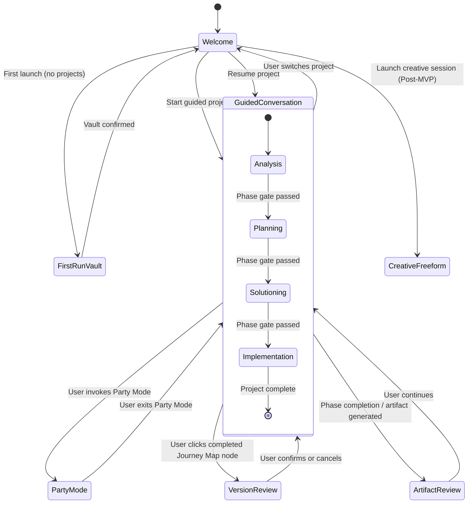

### Conversation Flow Architecture

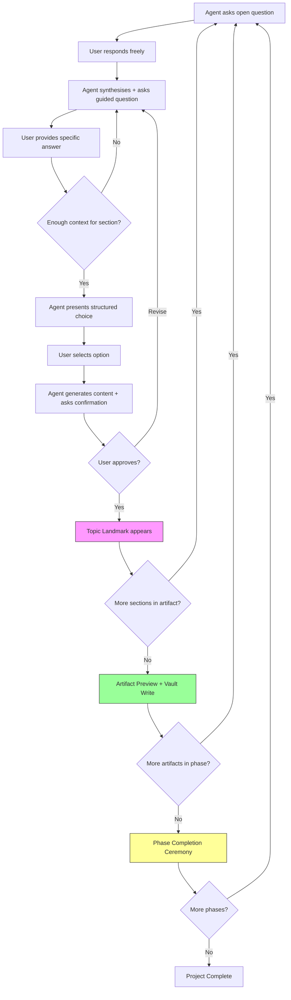

### Journey Map State Machine

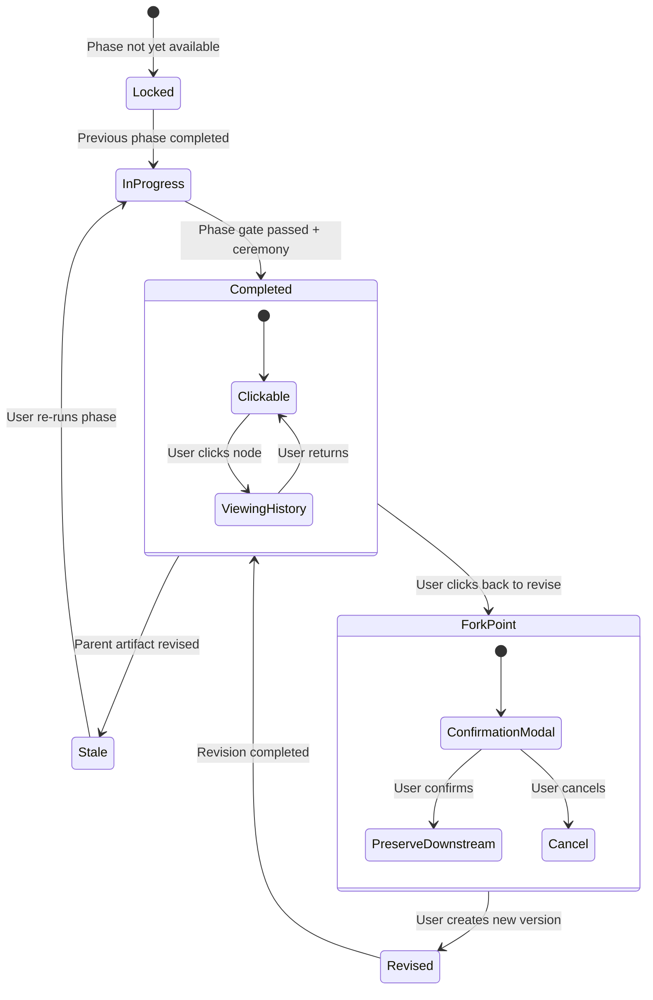

### Five-Act Onboarding Sequence

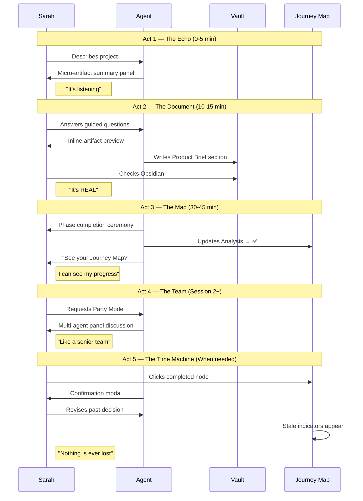

### Auto-Save & Trust Architecture

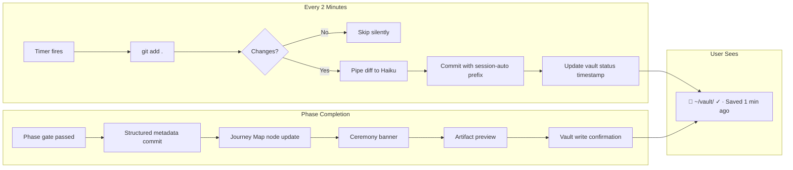

### Party Mode Interaction Flow

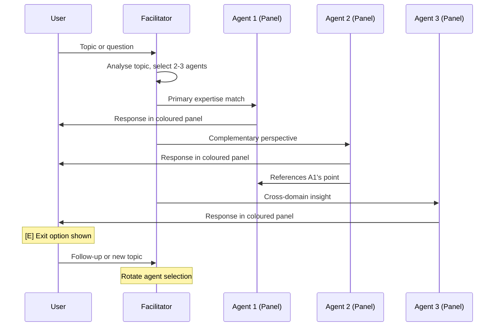

### Design Rationale

The design direction is a direct consequence of five converging constraints:

1. **Framework constraint:** Textual/Rich determines the component vocabulary. Every visual element maps to a known primitive. The design direction is the framework's capabilities applied with semantic intention.

2. **Persona constraint:** Sarah-first filtering means every layout decision, every visual weight, every interaction pattern must pass the "does a non-technical project manager understand this without help?" test.

3. **Emotional constraint:** Control, pride, trust, energy — these emotional goals dictate warm colours, generous panels, celebration ceremonies, and passive safety indicators over clinical efficiency.

4. **Architectural constraint:** The Git-backed state engine and Obsidian output format are invisible infrastructure. The Journey Map is the sole user-facing expression of the underlying architecture.

5. **Interaction constraint:** Conversation is the primary interaction. The layout exists to support and orient a conversational experience — sidebar for spatial context, main panel for conversation, footer for passive safety.

### Implementation Approach

**Widget hierarchy (Textual composition):**

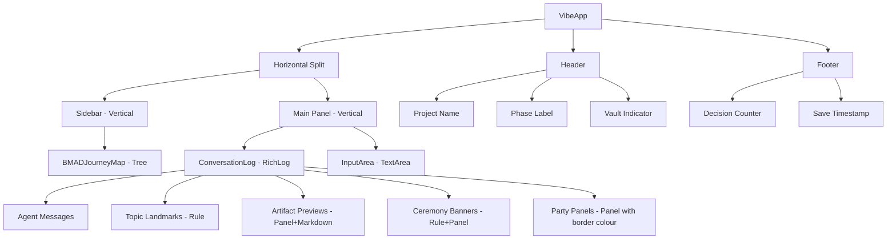

**Textual CSS structure:**
- `vibe.tcss` — extends Toad's default theme with semantic colour tokens
- `journey_map.tcss` — styles for BMADJourneyMap node states
- `party_mode.tcss` — agent panel border colour assignments
- `ceremony.tcss` — phase completion banner styling

All CSS files use Toad's theme variables as base — no hardcoded values.

## User Journey Flows

### Journey 1: Sarah's First-Run Experience

The most critical journey — if this fails, nothing else matters.

```mermaid
flowchart TD
    Start[Sarah opens browser at localhost:8000] --> Detect{First run?}
    Detect -->|Yes| Vault[Vault Configuration Screen]
    Detect -->|No| Welcome[Welcome Screen]

    Vault --> ShowPath[Display vault path in OS-native format]
    ShowPath --> TestWrite[System writes vibe-test.md to vault]
    TestWrite --> AskConfirm[Ask Sarah: Can you see vibe-test.md in Obsidian?]
    AskConfirm --> Confirmed{Sarah confirms?}
    Confirmed -->|Yes| CleanTest[Remove test file]
    Confirmed -->|No| DiagnoseVault{Diagnose failure}
    DiagnoseVault -->|Path not found| PathHelp[Directory doesn't exist — guide creation]
    DiagnoseVault -->|Not writable| PermHelp[Permissions issue — OS-specific fix steps]
    DiagnoseVault -->|Obsidian doesn't see it| ObsHelp[Vault not registered — guide Obsidian setup]
    PathHelp --> ShowPath
    PermHelp --> ShowPath
    ObsHelp --> ShowPath
    CleanTest --> Welcome

    Welcome --> ThreeButtons{Sarah chooses}
    ThreeButtons -->|Start guided project| ProjectName[Enter project name]
    ThreeButtons -->|Resume project| ProjectList[Show project list]
    ThreeButtons -->|Creative session| PostMVP[Post-MVP]

    ProjectName --> DupCheck{Name unique?}
    DupCheck -->|No| NameGuidance[Suggest unique name]
    NameGuidance --> ProjectName
    DupCheck -->|Yes| InitProject[Create Git branch + SQLite entry]

    InitProject --> AgentGreet[Agent: Tell me about this project]

    AgentGreet --> Act1["Act 1: The Echo (0-5 min)"]
    Act1 --> OpenNarrative[Sarah describes project freely]
    OpenNarrative --> MicroArtifact[Micro-artifact summary panel appears]
    MicroArtifact --> GuidedLoop["Act 2: Guided conversation loop"]

    GuidedLoop --> GuidedQ[Agent asks guided question]
    GuidedQ --> Answer[Sarah answers]
    Answer --> Enough{Section complete?}
    Enough -->|No| GuidedQ
    Enough -->|Yes| Choice[Agent presents structured choice]
    Choice --> Pick[Sarah decides]
    Pick --> Confirm[Agent shows content + asks confirmation]
    Confirm --> Approved{Approved?}
    Approved -->|Revise| GuidedQ
    Approved -->|Yes| Landmark[Topic Landmark appears]

    Landmark --> MoreSections{More sections?}
    MoreSections -->|Yes| GuidedQ
    MoreSections -->|No| ArtifactPreview[Artifact preview + vault write]

    ArtifactPreview --> Act2Check[Agent: Check your Obsidian vault]
    Act2Check --> MoreArtifacts{More artifacts in phase?}
    MoreArtifacts -->|Yes| GuidedLoop
    MoreArtifacts -->|No| Ceremony["Act 3: Phase Completion Ceremony"]

    Ceremony --> Banner[Ceremony banner in conversation]
    Banner --> MapUpdate[Journey Map: Analysis ✅ Planning unlocked]
    MapUpdate --> MapIntro[Agent introduces Journey Map]
    MapIntro --> NextPhase[Agent: Ready for Planning?]

    NextPhase --> Continue{Sarah continues?}
    Continue -->|Yes| GuidedLoop
    Continue -->|Close browser| AutoSave[Auto-save captures state]

    style MicroArtifact fill:#9f9,stroke:#333
    style ArtifactPreview fill:#9f9,stroke:#333
    style Ceremony fill:#ff9,stroke:#333
    style Landmark fill:#f9f,stroke:#333
```

**Key design decisions in this flow:**
- Vault validation is a hard gate — no workflow begins until vault is confirmed
- Human-in-the-loop confirmation (Sarah checks Obsidian) closes the trust gap
- Vault troubleshooting branches into three distinct failure modes: path not found, not writable, Obsidian doesn't recognise vault — each with specific recovery guidance
- The five-act teaching narrative is embedded in the flow sequence
- Auto-save ensures closing the browser is always safe

**Error paths:**
- Vault path not found → guide directory creation with OS-specific instructions
- Vault path not writable → permissions troubleshooting (different for macOS/Windows/Linux)
- Obsidian doesn't see vault → guide vault registration in Obsidian settings
- Duplicate project name → gentle redirect with suggestion
- Agent response failure → "Your progress is saved. Click to retry" (inline, not modal)
- Browser disconnect mid-conversation → reconnect picks up from last auto-save

### Journey 2: Returning User Resume

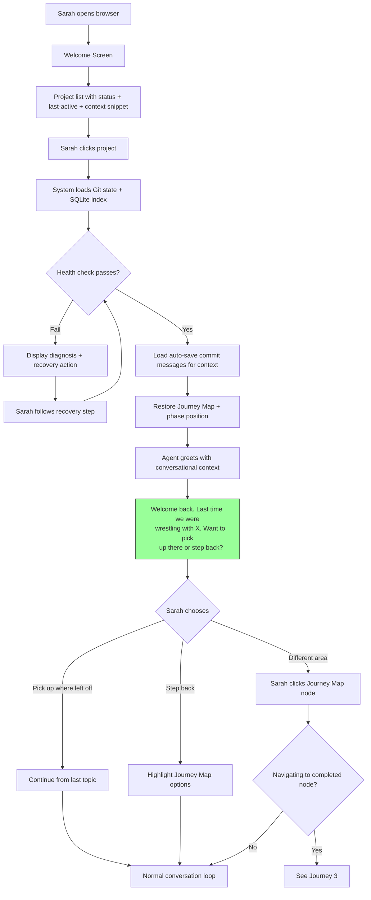

**Key design decisions:**
- Project list shows status + last-active date + **one-line context snippet** from the last auto-save commit message (e.g., "Acme Digital Transformation — last worked on user personas"). This is far more useful than just a date for identifying projects.
- Health check runs silently on load — only surfaces if something is wrong
- Agent greeting uses auto-save commit messages for emotional continuity — "we were wrestling with X," not "you completed section Y"
- Three resume options: continue, step back, or navigate — Sarah controls
- The greeting is the first trust checkpoint for returning users

### Journey 3: Click-Back & Revision

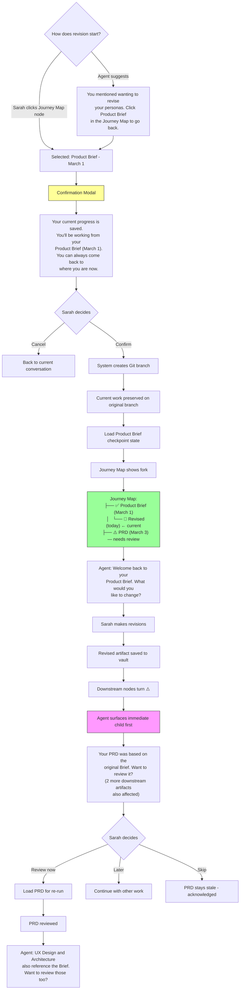

**Key design decisions:**
- Two entry points for revision: direct click or agent suggestion
- Confirmation modal uses plain language — no technical terms, no Git vocabulary
- Fork rendered as child node with temporal labels (dates, not version numbers)
- **Stale notifications cascade** — agent surfaces the immediate child first ("Your PRD was based on the original Brief"), then after handling that, mentions remaining downstream artifacts. Never dumps all stale items at once (respects cognitive load budget).
- Three options for handling stale artifacts: review now, later, or acknowledge and skip
- "Cancel" on the modal is always safe — nothing changes

**Edge cases handled:**
- Multiple downstream stale artifacts → cascading notification, immediate child first, then remaining
- Revising a revision (nested fork) → same flow, child node under the revision
- Abandoning a revision mid-way → auto-save preserves partial revision; next session prompt includes the auto-save commit message from the abandoned revision plus a diff summary ("you changed 3 sections in the Product Brief") so Sarah has enough context to decide even weeks later

### Journey 4: Party Mode

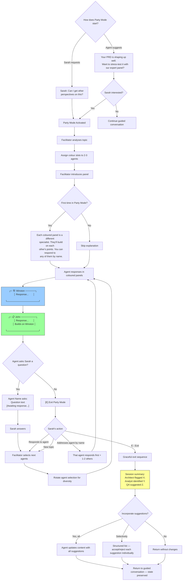

**Key design decisions:**
- Two entry points: user-initiated or agent-suggested (at natural moments)
- First-time explanation of the visual format — taught once, not repeated
- Agents can ask Sarah direct questions — conversation pauses until she responds
- Agent rotation ensures diverse participation across rounds
- Addressing an agent by name prioritises that agent
- Graceful exit includes summary of insights + choice to incorporate
- **Selective incorporation via structured list** — each suggestion presented individually with accept/reject, not a blanket yes/no. Sarah evaluates each insight on its merits (agency preserved).
- State is fully preserved — returning to guided mode continues exactly where she left off

### Journey 5: Error Recovery

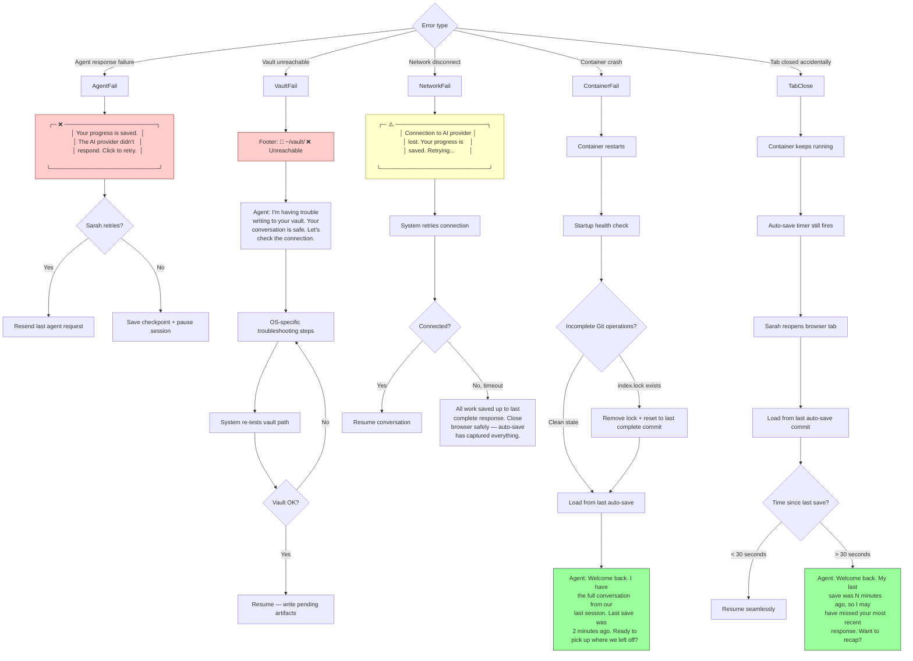

**Key design decisions:**
- Every error message leads with "your progress is saved" (reassurance-first principle)
- No raw error messages or stack traces — ever
- Vault issues are surfaced by the agent conversationally AND by the status indicator (dual-signal)
- Container crash recovery specifies: check for `.git/index.lock`, reset to last complete commit, then load state
- Network disconnect has automatic retry before showing failure
- **Auto-save fallback:** When the AI provider is unreachable during auto-save, the system falls back to a timestamp-based commit message (`[session-auto] 2026-03-08T14:32:00 — AI unavailable`) — never skips the commit itself
- **Tab-close scenario (most common error):** Container keeps running, auto-save continues. On browser reload, system loads from last commit. If more than 30 seconds have passed, the agent acknowledges the potential gap and offers to recap.
- Every error has a single clear recovery action — no multi-step troubleshooting without guidance

### Journey Patterns

**Patterns consistent across all journeys:**

1. **Dual entry point:** Every significant action can be reached by direct user interaction OR agent suggestion. No capability is hidden — but the agent proactively surfaces actions at natural moments.

2. **Confirmation before irreversible:** Version creation (click-back) requires a modal. Everything else — saving, navigating, invoking Party Mode — is immediately reversible or undoable.

3. **Reassurance-first errors:** Every error path leads with what's safe before explaining what's wrong. Recovery is always a single, clear action.

4. **State preservation on exit:** Whether leaving Party Mode, closing the browser, or recovering from a crash — the user's work is never lost and context is always reconstructable.

5. **Progressive teaching:** Novel interactions are introduced at the moment they're first needed, with explicit explanation on first encounter and implicit familiarity afterwards.

6. **Cascading notifications:** When multiple items need attention (stale artifacts, suggestions to incorporate), surface one at a time with a count of remaining. Never dump a list that overwhelms the cognitive load budget.

### Flow Optimization Principles

1. **5-6 productive interactions to first structured output, zero configuration:** Vault confirm (trust) → welcome click (intent) → project name (ownership) → describe project (creative input) → micro-artifact echo (proof of comprehension). Every interaction is productive — none are setup, config, or boilerplate. Compare to typical tools where 5-6 interactions are all configuration before work begins.

2. **No dead ends:** Every error, every edge case, every unexpected state has a forward path. Troubleshooting loops always have an escape. The user is never stuck.

3. **Cognitive load budget:** Each screen/state shows only what's relevant to the current action. The Journey Map collapses completed phases. The footer shows passive indicators. The conversation is the focus. Stale notifications cascade rather than dumping all at once.

4. **Graceful degradation:** If the AI provider is down, conversation pauses but data is safe. If the vault is unreachable, conversation continues but artifact writes queue. If the browser tab closes, the container keeps running and auto-save continues. Auto-save falls back to timestamp-based commit messages when AI is unavailable. Nothing catastrophic ever happens.

## Component Strategy

### Design System Components (Rich/Textual Foundation)

These require no custom work — used as-is with semantic styling via Toad's theme tokens:

| Foundation Component | Primitive | Usage |
|---------------------|-----------|-------|
| `Tree` | Navigation widget | Base for Journey Map |
| `RichLog` | Scrollable log | Conversation panel (max_lines: 10,000) |
| `Input` / `TextArea` | Text entry | User input area |
| `Panel` | Bordered container | Agent messages, artifact previews, errors |
| `Rule` | Horizontal divider | Topic landmarks, ceremony separators |
| `Markdown` | Rich text rendering | Artifact content previews |
| `Button` | Clickable action | Welcome screen options |
| `ModalScreen` | Overlay dialog | Irreversible action confirmation |
| `Header` / `Footer` | Persistent bars | Status, project context, save indicator |
| `Horizontal` / `Vertical` | Layout containers | Sidebar + main panel split |

**RichLog scrollback:** `max_lines` set to 10,000. When conversation content exceeds this limit, old entries are pruned. If a Journey Map node references pruned content, a summary panel is displayed instead of scrolling to the original position.

### Custom Components

All custom components extend or compose Rich/Textual primitives. No external widget libraries. All styling via Toad's theme tokens — no hardcoded values.

#### ConversationEntry Class Hierarchy

All content appended to the `RichLog` conversation panel uses a typed entry system for programmatic identification, filtering, and search:

| Entry Type | Purpose | Visual Treatment |
|-----------|---------|-----------------|
| `UserMessage` | User's text input | Normal text, no border |
| `AgentMessage` | Guided conversation responses | Agent name prefix (bold) |
| `FacilitatorNote` | Party Mode orchestration | Dim italic, no border |
| `LandmarkEntry` | Topic transition marker | `Rule(style="dim")` with label |
| `CeremonyEntry` | Phase completion celebration | `Rule` + `Panel` composition |
| `ArtifactEntry` | Artifact preview (draft or complete) | `Panel` + `Markdown` |
| `ErrorEntry` | Error display with recovery action | `Panel` with `--vibe-error` border |
| `PartyEntry` | Party Mode agent response | `Panel` with coloured border |

This hierarchy prevents string-parsing the conversation log and enables future features (filtering by type, export, search).

#### 1. BMADJourneyMap

**Purpose:** The product's signature interaction — a navigable, clickable decision history tree showing the complete project lifecycle with temporal labels and causal dependency tracking.

**Extends:** `Tree` widget

**Data contract:**
```
JourneyNode:
  id: str
  label: str
  date: datetime
  state: enum (completed, in_progress, locked, stale, fork)
  causal_label: str | None  # e.g., "based on March 1 Brief"
  children: list[JourneyNode]
```

**States:**

| State | Icon | Colour Token | Interaction |
|-------|------|-------------|-------------|
| Completed | ✅ | `--vibe-completed` | `Space` to activate — triggers click-back flow (Journey 3) |
| In-progress | 🔵 | `--vibe-active` | Current position — not activatable |
| Locked | 🔒 | `--vibe-locked` | No interaction — dim text |
| Stale | ⚠️ | `--vibe-stale` | `Space` to activate — label shows cause |
| Fork (revised) | 📝 | `--vibe-active` | Nested child of original node |

**Keyboard bindings:**
- `Up/Down` arrow keys: navigate between nodes (Textual `Tree` default)
- `Enter`: expand/collapse phase groups (Textual `Tree` default)
- `Space`: activate node (trigger click-back modal for completed/stale nodes)
- `Ctrl+B`: toggle sidebar visibility

**Label overflow handling:** Sidebar width is 30-35 characters. Labels are abbreviated to fit: "📝 Rev'd Brief (Mar 7)". When a node is focused, the full label ("📝 Revised Product Brief (March 7)") is displayed in the footer bar.

**Accessibility:** Node labels include state text: "Product Brief, completed, March 1". Full label shown in footer on focus.

**Behaviour:**
- Collapsed by default for completed phases — expanded for current phase
- Forks rendered as nested children with temporal labels (dates, not versions)
- Stale nodes show causal label inline (abbreviated if needed)

#### 2. CeremonyBanner

**Purpose:** Phase completion celebration — a visual break that marks accomplishment and creates emotional momentum. The payoff of Act 3 in the teaching narrative.

**Composed from:** `Rule` + `Panel` (wrapped as `CeremonyEntry`)

**Data contract:**
```
CeremonyData:
  phase_name: str
  artifact_count: int
  decision_count: int
  next_phase_name: str
  next_phase_teaser: str
```

**Example rendering:**
```
━━━━━━━━━━━━━━━━━━━━━━━━━━━━━━━━━━━━━━━━
╭─ ✓ Analysis Phase Complete ──────────╮
│                                       │
│ You produced 2 artifacts and made     │
│ 12 decisions. Planning is now         │
│ unlocked — we'll turn your Brief      │
│ into detailed requirements.           │
│                                       │
╰───────────────────────────────────────╯
━━━━━━━━━━━━━━━━━━━━━━━━━━━━━━━━━━━━━━━━
```

**States:** Single state — always celebratory. Border uses `--vibe-ceremony` token.

**Spacing:** 1 blank line above and below. Full main-panel width.

#### 3. ArtifactPanel

**Purpose:** Unified component for artifact display — from the first "it's listening" micro-echo (Act 1) through full artifact previews (Act 2) and beyond. Single component, multiple states.

**Composed from:** `Panel` + `Markdown` (wrapped as `ArtifactEntry`)

**Data contract:**
```
ArtifactData:
  title: str
  content_markdown: str
  vault_path: str | None
  state: enum (draft, writing, saved, error)
  source_line_limit: int = 15
```

**Truncation rule:** First 15 lines of **markdown source** (not rendered lines). Footer shows "[N more sections in full document]" + vault path.

**States:**

| State | Border Token | Footer Text | Usage |
|-------|-------------|-------------|-------|
| Draft | `--vibe-active` | "[Draft — will evolve as we discuss]" | Micro-artifact echo (Act 1) |
| Writing | `--vibe-active` | "Saving to vault..." | During vault write |
| Saved | `--vibe-completed` | "📂 Saved to ~/vault/path.md" | After successful write |
| Error | `--vibe-error` | "Queued — vault unreachable" | Vault write failed |

**Lifecycle:** Draft → Writing → Saved (normal) or Draft → Writing → Error (vault issue).

#### 4. VaultStatusIndicator

**Purpose:** Persistent passive trust signal — Sarah can always glance at the footer and see that her data is safe.

**Extends:** `Footer` element

**Data contract:**
```
VaultStatus:
  path: str  # OS-native format
  state: enum (healthy, unreachable, pending)
  last_save: datetime | None
```

**Example renderings:**
- Healthy: `📂 ~/vault/ ✓ · Saved 1 min ago`
- Just saved: `📂 ~/vault/ ✓ · Saved just now`
- Unreachable: `📂 ~/vault/ ❌ · Unreachable`
- Pending: `📂 ~/vault/ ? · Validating...`

**States:**

| State | Icon | Colour | Behaviour |
|-------|------|--------|-----------|
| Healthy | ✓ | `--vibe-completed` | Updates timestamp text on each auto-save |
| Unreachable | ❌ | `--vibe-error` | Triggers agent conversational warning |
| Pending | ? | `--vibe-stale` | Before vault validation completes |

**Simplification:** No timed bold highlight on save. The timestamp text changing from "Saved 2 min ago" to "Saved just now" is sufficient visual feedback without async timer management.

#### 5. ContentProgressIndicator

**Purpose:** Micro-orientation within a long conversation — shows which artifact sections have been captured vs upcoming.

**Composed from:** `Static` widget with styled text (appended to `RichLog` inline)

**Data contract:**
```
ProgressData:
  artifact_name: str
  sections: list[SectionProgress]

SectionProgress:
  name: str
  state: enum (upcoming, discussing, captured)
```

**Placement:** Inline in conversation — the agent appends it periodically as a `Static` widget to the `RichLog`. Not in the sidebar (avoids a separate widget implementation and keeps the sidebar focused on the Journey Map).

**Example rendering:**
```
Product Brief — building...
  ✅ Project overview (captured)
  🔵 User personas (discussing now)
  ○ Success metrics (upcoming)
  ○ MVP scope (upcoming)
```

**State transitions:** Sections progress: upcoming (○) → discussing (🔵) → captured (✅). Never regress.

#### 6. PartyModePanel

**Purpose:** Visual identity for multi-agent discussion — each specialist gets a distinct coloured panel.

**Extends:** `Panel` with dynamic border colour (wrapped as `PartyEntry`)

**Data contract:**
```
PartyResponse:
  agent_name: str
  agent_icon: str  # emoji
  colour_slot: int  # 1-8
  response_text: str
```

**Example rendering:**
```
╭─ 🏗️ Winston (Architect) ────────────╮
│ The scalability concern is valid.    │
│ I'd suggest a queue-based approach   │
│ rather than direct API calls...      │
╰──────────────────────────────────────╯
```

**Colour assignment:** 8 pre-defined `--vibe-agent-1` through `--vibe-agent-8` tokens, assigned per-session based on participation order. No two adjacent panels share the same colour.

**Word limit:** Soft limit of ~150 words per panel. If an agent response exceeds this, it splits into the initial panel + a "continues..." expansion that the user can click to reveal. Keeps the conversation feeling like dialogue, not lectures.

**Facilitator voice:** Not in a panel — rendered as `FacilitatorNote` entry (dim italic text between panels). Visually recessive.

#### 7. TopicLandmark

**Purpose:** Scannable conversation structure — marks transitions between topics within the conversation stream.

**Composed from:** `Rule(style="dim")` with label (wrapped as `LandmarkEntry`)

**Data contract:**
```
LandmarkData:
  label: str
  landmark_id: str  # for Journey Map scroll-to linking
```

**Example rendering:**
```
── User Personas Complete ──
```

**States:** Single state — always dim. Provides indexed scroll targets for Journey Map click-to-navigate.

#### 8. ProjectListItem

**Purpose:** Rich project entry for the returning user welcome screen — provides enough context for Sarah to identify her project without opening it.

**Composed from:** `Static` widget or `ListItem`

**Data contract:**
```
ProjectListData:
  project_name: str
  status: enum (in_progress, completed, paused)
  current_phase: str
  last_active: datetime
  context_snippet: str  # from last auto-save commit message
```

**Example rendering:**
```
┌──────────────────────────────────────┐
│ Acme Digital Transformation     🔵   │
│ Planning phase · Last active Mar 7   │
│ Working on user personas             │
└──────────────────────────────────────┘
```

**Behaviour:** Clickable — loads the selected project (Journey 2 flow). Status icon uses the standard state encoding (🔵 in-progress, ✅ completed, ⏸ paused).

#### 9. ErrorRecoveryPanel

**Purpose:** Reassurance-first error display with single clear recovery action.

**Composed from:** `Panel(border_style=--vibe-error)` + action text (wrapped as `ErrorEntry`)

**Data contract:**
```
ErrorData:
  safe_message: str      # always first: "Your progress is saved."
  explanation: str       # what happened
  action_label: str      # what to do: "Click to retry"
  severity: enum (error, warning)
  state: enum (active, recovered)
```

**Rule:** First line is ALWAYS what's safe. Second line is what happened. Third line is the action.

**Recovery transition:** On successful retry, the panel transitions from `active` to `recovered`:
- Border changes from `--vibe-error` to `--vibe-completed`
- Text updates to "Recovered — continuing where we left off"
- Panel remains in conversation history but no longer demands attention

**Example renderings:**
```
╭─ ❌ ─────────────────────────────────╮   (active)
│ Your progress is saved.              │
│ The AI provider didn't respond.      │
│ Click to retry.                      │
╰──────────────────────────────────────╯

╭─ ✓ ──────────────────────────────────╮   (recovered)
│ Recovered — continuing where we      │
│ left off.                            │
╰──────────────────────────────────────╯
```

#### 10. DecisionCounter

**Purpose:** Subtle momentum signal — accumulating count of decisions made, reinforcing productive progress.

**Extends:** `Footer` element

**Data contract:**
```
DecisionCount:
  count: int
  visible_threshold: int = 5
```

**Example:** `12 decisions`

**Behaviour:** Increments on each confirmed topic landmark or structured choice. Never decrements. **Hidden until count reaches 5** — the first appearance is itself a micro-delight moment. Sarah glances at the footer and discovers she's been productive without realising it. Resets per project, persists across sessions.

### Component Implementation Strategy

**Build approach:** All custom components extend or compose Rich/Textual primitives. No external widget libraries. All styling via Toad's theme tokens — no hardcoded values.

**Data contracts:** Each component declares the shape of data it expects (documented above). These contracts form the interface between the UI layer and the state engine (Git + SQLite). The state engine produces data in these shapes; components consume them. No ad-hoc prop-drilling or string formatting.

**ConversationEntry typing:** All content in the `RichLog` is wrapped in typed `ConversationEntry` subclasses. This enables programmatic filtering, search, export, and prevents string-parsing the conversation log.

**Testing strategy:** Each custom widget testable in isolation via Textual's `pilot` testing framework. State transitions verified programmatically. Data contracts enforced by type hints.

**Consistency enforcement:** All custom components reference the same state encoding vocabulary (✅/🔵/🔒/⚠️/❌) and semantic colour tokens defined in the Design System Foundation.

### Implementation Roadmap

**Phase 1 — Core (MVP launch blockers):**
1. **BMADJourneyMap** — needed for all navigation, progress, click-back
2. **VaultStatusIndicator** — needed for trust from first interaction
3. **ArtifactPanel** — needed for Act 1 echo and Act 2 artifact preview
4. **CeremonyBanner** — needed for Act 3 phase completion (emotional reward loop)
5. **ErrorRecoveryPanel** — needed for all error paths
6. **TopicLandmark** — needed for conversation structure
7. **ProjectListItem** — needed for every returning user (Journey 2)
8. **ConversationEntry hierarchy** — architectural foundation for all log entries

**Phase 2 — Experience (MVP polish + Party Mode):**
9. **PartyModePanel** — needed when Party Mode ships (can be triggered in session 1)
10. **ContentProgressIndicator** — enhances orientation during long conversations
11. **DecisionCounter** — subtle momentum signal, low effort

Prioritisation follows the five-act teaching narrative and journey dependencies: components needed for earlier acts and more common journeys ship first. Party Mode moved to Phase 2 because the agent can suggest it in session 1.

## UX Consistency Patterns

### Agent Communication Patterns

The agent is the primary UI — its communication style IS the user experience. These patterns ensure consistency across all agent interactions.

#### Question Framing

| Context | Agent Tone | Example |
|---------|-----------|---------|
| Opening a topic | Warm, inviting, open-ended | "Tell me about your target users." |
| Drilling deeper | Focused, curious | "You mentioned enterprise clients — what's their biggest pain point?" |
| Surfacing tension | Collaborative, non-judgmental | "Earlier you said speed was critical, but you also want thorough validation. Help me resolve this." |
| Offering options | Structured, empowering | "I see three approaches here. Which resonates with how you work?" |
| Seeking confirmation | Deferential, concise | "Here's what I've captured. Does this reflect your thinking?" |

**Rule:** The agent never asks more than one question per message. Multiple questions dilute focus and create ambiguity about what to answer.

#### Proactive Surfacing

When the agent wants to introduce a capability (Party Mode, click-back, etc.), it follows this pattern:

1. **Context:** Reference the current work — "Your requirements are shaping up well."
2. **Suggestion:** Frame as optional — "Would you like to stress-test them with our expert panel?"
3. **Explanation (first time only):** Brief description — "Each specialist brings a different perspective in coloured panels."
4. **No pressure:** Always has an implicit "or we can continue" — never blocks progress on acceptance.

**Rule:** Proactive suggestions appear at natural transition points (between topics, after confirmations), never mid-thought.

#### Substantive Content Boundary

| Belongs to the user | Belongs to the agent |
|---------------------|---------------------|
| Ideas, decisions, domain knowledge | Structure, organisation, prose polish |
| Priority choices, trade-off resolutions | Completeness checking, gap identification |
| Creative direction, naming, framing | Formatting, frontmatter, wikilinks |
| "Yes/no/revise" authority | Synthesis, summarisation |

**Rule:** The agent never introduces substantive content the user hasn't expressed. It structures, polishes, and challenges — but the ideas are always the user's. This preserves the pride-of-authorship emotional goal.

#### Adaptive Pacing

| Signal | Agent Response |
|--------|---------------|
| User gives long, detailed answers | Agent matches depth — asks targeted follow-ups |
| User gives terse answers | Agent provides more structure — offers choices instead of open questions |
| User says "I'm not sure" | Agent reframes — "Let me suggest some options based on what you've said so far" |
| User contradicts earlier input | Agent surfaces tension without judgment — "Help me reconcile these two directions" |
| User has been answering for 10+ minutes without a tangible output | Agent produces a micro-artifact or progress indicator — proof of accumulation |

**Rule:** The agent tracks engagement rhythm and adjusts. Never more than two confirmations in sequence (agency protection rule).

### Feedback Patterns

All feedback uses the same visual vocabulary across every component and context.

#### Feedback Hierarchy

From most to least intrusive:

| Level | Mechanism | When Used | Example |
|-------|-----------|-----------|---------|
| **Modal** | `ModalScreen` overlay | Irreversible actions only | Click-back version creation |
| **Error panel** | `ErrorRecoveryPanel` inline | System failures requiring action | AI provider down, vault unreachable |
| **Agent conversational** | Agent message | Contextual warnings, stale notifications | "Your PRD was based on the original Brief..." |
| **Status indicator** | Footer element | Passive ongoing state | Vault status, save timestamp |
| **Inline transition** | Component state change | Automatic state updates | ArtifactPanel draft→saved, error→recovered |

**Rule: Never escalate feedback level unnecessarily.** A stale artifact is a conversational mention + Journey Map indicator, not a modal. A successful save is a footer timestamp update, not an agent message. Only irreversible actions get modals.

#### Success Feedback

1. Component transitions visually (border colour, icon change)
2. No interruption to conversation flow
3. Agent acknowledges only at significant milestones (artifact complete, phase complete)

#### Error Feedback (Reassurance-First)

1. First line: what's safe ("Your progress is saved")
2. Second line: what happened ("The AI provider didn't respond")
3. Third line: single action ("Click to retry")
4. On recovery: panel softens to success state — no lingering red

#### Warning Feedback (Dual-Signal)

1. Passive: visual indicator on the relevant component (⚠️ on Journey Map node)
2. Active: agent mentions it conversationally at a natural moment
3. Both signals together — user can't miss it but isn't interrupted

### Navigation Patterns

#### Primary Navigation: Journey Map (Sidebar)

| Action | Trigger | Result |
|--------|---------|--------|
| View current position | Glance at sidebar | 🔵 node highlighted, phase expanded |
| Navigate to completed item | `Space` on completed node | Confirmation modal → load checkpoint |
| Expand/collapse phase | `Enter` on phase node | Toggle children visibility |
| Toggle sidebar | `Ctrl+B` | Sidebar appears/disappears |
| View full node label | Focus any node | Full label + date shown in footer |

**Rule:** The Journey Map is read-only for locked (🔒) and in-progress (🔵) nodes. Only completed (✅) and stale (⚠️) nodes are activatable. This prevents users from accidentally jumping to incomplete states.

#### Secondary Navigation: Conversation Landmarks

| Action | Trigger | Result |
|--------|---------|--------|
| Scroll to topic | Click Journey Map checkpoint | Conversation scrolls to corresponding `LandmarkEntry` |
| Scan conversation | Visual scan | `TopicLandmark` rules create scannable sections |
| Return to input | `Escape` or click input area | Focus returns to text input (always-visible at bottom) |

**Rule:** The text input area is always visible and always default-focused. Navigation is supplementary — the conversation is the primary workspace.

#### Context Preservation on Navigation

| Navigation Event | State Preserved |
|-----------------|----------------|
| Leave Party Mode | Guided conversation position, Journey Map state |
| Click-back to earlier node | Current work on original branch, auto-saved |
| Close browser tab | Last auto-save commit, full conversation recoverable |
| Switch projects | Each project's state independent, stored in separate branches |

### Input Patterns

#### The Four Input Types

| Input Type | Agent Visual Cue | User's Input Widget | Post-Input |
|-----------|-----------------|--------------------| -----------|
| **Open narrative** | Warm open question, no options | `TextArea` (multi-line) | Agent synthesises response |
| **Guided question** | Specific question, clear scope | `Input` (single-line) or `TextArea` | Agent integrates answer |
| **Structured choice** | Numbered/lettered options | `Input` (type letter/number) | Agent acts on selection |
| **Confirmation** | Content preview + "Does this look right?" | `Input` (y/n/revise) | Agent saves or returns to guided |

#### Pacing Cycle

```
Open → Guided → Guided → Structured Choice → Confirmation → [Landmark] → Open → ...
```

**Rules:**
- Never more than two confirmations in sequence (agency protection)
- After a confirmation, return to open or guided to re-engage creative thinking
- Each cycle ≈ 10-15 minutes, ending with a tangible output (landmark or artifact preview)
- The cycle is a guideline, not rigid — agent adapts to user's engagement signals

### Modal & Confirmation Patterns

#### Modal Usage: Irreversible Actions Only

| Action | Modal? | Rationale |
|--------|--------|-----------|
| Click-back to revise earlier artifact | ✅ Yes | Creates Git branch, marks downstream stale |
| Save artifact to vault | ❌ No | Reversible via click-back |
| Enter Party Mode | ❌ No | Fully reversible, state preserved |
| Exit Party Mode | ❌ No | Guided conversation resumes |
| Close browser | ❌ No | Auto-save handles it |
| Delete project | ✅ Yes | Destructive, irreversible |

#### Modal Content Pattern

```
╭─ [Action Title] ─────────────────────╮
│                                       │
│ [What will happen — plain language]   │
│ [What's preserved — reassurance]      │
│                                       │
│        [Cancel]    [Confirm]          │
╰───────────────────────────────────────╯
```

**Rules:**
- Plain language — no technical terms, no Git vocabulary
- Always include what's preserved ("Your current work is saved")
- Cancel is always safe — nothing changes
- Two buttons maximum — no tri-state modals
- `Escape` = Cancel (keyboard accessible)

### Empty & Loading States

#### Loading States

| Context | Visual | Duration Expectation |
|---------|--------|---------------------|
| Agent thinking | Subtle animated indicator in conversation area (e.g., `...` or `typing`) | 2-10 seconds |
| Artifact generation | ContentProgressIndicator showing section being built | 5-30 seconds |
| Party Mode agent selection | Facilitator note: "Analysing your topic for the best perspectives..." | 1-3 seconds |
| Project loading (resume) | Journey Map populates progressively | 1-2 seconds |
| Vault write | ArtifactPanel in "writing" state | < 1 second |

**Rule:** Every loading state shows what's happening (not a generic spinner). The user should understand *what the system is doing*, not just that it's busy.

#### Empty States

| Context | What User Sees | Action |
|---------|---------------|--------|
| No projects (first run) | Welcome screen with "Start a guided project" button prominently featured | Single click to begin |
| Empty conversation (new project) | Agent greeting — no empty state, conversation starts immediately | Respond to agent |
| Empty Journey Map | Single root node with project name + first phase unlocked | Begin first workflow |
| No Party Mode history | No indicator — Party Mode appears when invoked | Agent suggests at natural moment |

**Rule:** True empty states are rare — the agent fills the space with a greeting, suggestion, or invitation. The UI never shows a blank panel with "nothing here yet."

### State Transition Patterns

How components move between states — consistency across all custom widgets:

| Transition | Visual Change | Timing |
|-----------|--------------|--------|
| Locked → In-progress | 🔒 dim grey → 🔵 warm blue, text becomes normal weight | Immediate on phase unlock |
| In-progress → Completed | 🔵 warm blue → ✅ warm green | Immediate + ceremony banner |
| Completed → Stale | ✅ green → ⚠️ amber + causal label appears | Immediate on parent revision |
| Draft → Saved (ArtifactPanel) | `--vibe-active` → `--vibe-completed` border, vault path appears | On vault write confirmation |
| Active → Recovered (ErrorPanel) | `--vibe-error` → `--vibe-completed` border, text softens | On successful retry |
| Hidden → Visible (DecisionCounter) | Counter appears in footer | On reaching 5 decisions |

**Rule:** All transitions are immediate — no animations in the terminal UI. State changes are communicated through icon + colour + text changes simultaneously (triple-encoding for accessibility).

**Consistency enforcement:** Every component that displays state uses the same encoding vocabulary from the Design System Foundation. No component invents its own state icons or colours.

## Responsive Design & Accessibility

### Terminal Width Adaptation

Vibe Visualiser is a browser-delivered terminal UI via Textual Web. There are no mobile breakpoints, touch targets, or media queries. "Responsive" means adapting to the browser viewport width, which Textual translates into character columns.

#### Layout Behaviour by Terminal Width

| Width | Columns | Layout | Behaviour |
|-------|---------|--------|-----------|
| Full desktop | 100+ chars | Sidebar (30-35ch) + Main panel (65+ ch) | Optimal — all elements visible |
| Narrow desktop | 80-99 chars | Sidebar (25-30ch) + Main panel (55-69ch) | Functional — sidebar narrows, labels abbreviate |
| Minimum usable | 60-79 chars | Single view — toggle between Conversation and Journey Map | `Ctrl+B` switches views; `Header` shows `[Map]` or `[Chat]`; `Footer` shows `Ctrl+B: switch to [other view]` |
| Below minimum | < 60 chars | Single centred message replacing entire UI | "The display needs a bit more space to show your project. Please widen your browser window — your work is safely saved." |

#### Narrow Width: View Toggle (Not Overlay)

Below 60 columns, the sidebar and main panel cannot coexist. Instead of an overlay panel (which introduces z-index complexity and focus management issues in a terminal UI), the layout switches to a **toggle model:**

- **Conversation view (default):** Full-width main panel with input area, no sidebar
- **Journey Map view:** Full-width Journey Map tree, no conversation
- `Ctrl+B` switches between them
- `Header` shows active view indicator: `[Chat]` or `[Map]`
- `Footer` shows hint: `Ctrl+B: switch to Map` or `Ctrl+B: switch to Chat`

**New content indicator:** When switching from Map view back to Conversation view, if new content was appended while the user was in Map view, a `TopicLandmark`-style divider appears: "── New messages below ──". Sarah never misses agent output that arrived while she was navigating.

**Welcome Screen carve-out:** The Welcome Screen uses single-column vertical button layout at all widths. Sidebar toggle only applies once a project is loaded.

#### Resize Behaviour

- **Debounce:** Layout recalculation waits 200ms after the last resize event before committing to a layout change. Prevents visual jitter during browser window drag.
- **Threshold crossing:** When the browser width crosses the 60-column or 80-column threshold, layout adapts. The transition is immediate after the debounce period.
- **max_lines width trade-off:** At narrow widths, conversation messages take more rendered lines (text wraps earlier). The `RichLog` max_lines budget (10,000) covers less conversation at narrow widths than at full width. This is a known trade-off, not a bug.

#### Width-Aware Agent Messaging

Agent messages that reference UI elements must adapt to the current layout. The agent has access to a reactive `LayoutState`:

```
LayoutState:
  sidebar_visible: bool
  current_view: enum (full, conversation_only, map_only)
  terminal_columns: int
  terminal_rows: int
```

**Adaptation rules:**
- If sidebar is hidden, agent says "Press `Ctrl+B` to see your Journey Map" instead of "See the sidebar"
- If terminal is narrow, agent omits references to footer details that may be truncated
- Layout changes are acknowledged on first occurrence only (progressive teaching pattern) — the agent explains a new UI element once, then assumes familiarity
- The five-act teaching narrative adapts: Act 3 (Journey Map introduction) references `Ctrl+B` toggle if sidebar is not visible at that moment

#### ArtifactPanel Width Adaptation

The ArtifactPanel is a **preview, not a renderer.** The vault copy is the canonical version; the inline preview proves the artifact exists and gives a taste of the content.

**Narrow-width content adaptation:**
- Tables with > 3 columns: switch to vertical key-value layout
- Content wider than available panel width: horizontal scroll within the panel (`overflow-x: scroll` in Textual CSS)
- Always show "Full document in your vault" footer — the vault has the real thing
- At very narrow widths (< 45ch content area), show title + section count + vault path only — minimal proof of existence

#### Browser Compatibility Gate

Textual Web requires a modern browser with WebSocket support. A minimal HTML shim is served before Textual boots:

```html
<script>
  if ('WebSocket' in window && window.innerWidth >= 480) {
    // Boot Textual Web application
  } else if (!('WebSocket' in window)) {
    // Show: "Vibe Visualiser requires a modern browser
    // with WebSocket support. Please use Chrome, Firefox,
    // Safari, or Edge."
  } else {
    // Show: "Vibe Visualiser is designed for desktop browsers.
    // For the best experience, open this link on a laptop
    // or desktop computer."
  }
</script>
```

This shim is a separate HTML file from the Textual application — it gates entry before the terminal UI loads. It checks:
1. WebSocket support (required for Textual Web)
2. Minimum viewport width (480px — catches phones and very small tablets)

### Accessibility Strategy

#### Universal Usability Principles

These principles protect every user — they are core UX design decisions that also happen to be accessibility best practices. They are listed first because they represent the broadest impact.

| Principle | Implementation |
|-----------|---------------|
| Reduced cognitive load | Progressive disclosure — five layers hide complexity |
| Consistent patterns | Same state encoding vocabulary across all components |
| Error prevention | Modals only for irreversible actions; everything else reversible |
| Clear language | No technical jargon in user-facing text; agent uses plain language |
| Predictable navigation | Journey Map position always visible; sidebar provides spatial orientation |
| Time independence | No time-limited interactions; auto-save preserves state |
| Single focus | One question per agent message; one action per error panel |
| Width adaptation | Agent messaging adapts to layout state; UI never references invisible elements |

#### Keyboard Accessibility

Every primary interaction is keyboard-accessible. No interaction requires a mouse.

**Keyboard bindings:**

| Action | Shortcut | Context |
|--------|----------|---------|
| Type response | Direct typing | Input area always focused by default |
| Submit response | `Enter` | Single-line input; `Ctrl+Enter` for multi-line |
| Toggle sidebar / switch view | `Ctrl+B` | Global — sidebar toggle at full width, view switch at narrow |
| Navigate Journey Map | `Up/Down` arrows | When sidebar/Map view focused |
| Expand/collapse phase | `Enter` | Journey Map node focused |
| Activate node (click-back) | `Space` | Completed/stale Journey Map node focused |
| Dismiss modal | `Escape` | Modal open |
| Return to input | `Escape` | Sidebar or other widget focused |

**Tab order:** Input area (default) → Sidebar → Header actions. Input area is always the default focus target.

**Focus management rules:**
- After modal dismiss, focus MUST return to the input area, not stay on the sidebar
- No shortcut conflicts with typing — all shortcuts use modifier keys (`Ctrl`) or are only active when non-input widgets are focused
- `Ctrl+B` may conflict with browser-level shortcuts (bold in some contexts) — must be tested across Chrome, Firefox, Safari, Edge; document any conflicts and provide alternative binding if needed

**Keyboard interaction matrix (test specification):**

| Shortcut | Input Focused | Sidebar Focused | Modal Open | No Focus Target |
|----------|--------------|----------------|------------|-----------------|
| `Ctrl+B` | Toggle sidebar | Toggle sidebar | Blocked | Toggle sidebar |
| `Up/Down` | Normal typing | Navigate nodes | Navigate buttons | No action |
| `Enter` | Submit message | Expand/collapse node | Confirm action | No action |
| `Space` | Normal typing (space char) | Activate node | No action | No action |
| `Escape` | No action | Return to input | Dismiss modal | No action |
| `Tab` | Move to sidebar | Move to header | Cycle modal buttons | Move to input |

Every cell in this matrix is a test case. The `Space` key behaviour is context-dependent — types a space when input is focused, activates a node when sidebar is focused. Focus management must be airtight to prevent accidental node activation.

#### Visual Accessibility

| Criterion | Approach | Standard |
|-----------|----------|----------|
| Contrast ratio | All text meets 4.5:1 against background | WCAG AA |
| Colour independence | Every state encoded with icon shape + text label + colour | Triple encoding |
| Theme support | Light and dark themes via Toad's theme system | Both meet contrast requirements |
| Text scaling | Inherits browser/terminal font size settings | User-controlled |
| Focus indicators | Textual default reverse-video for focused widgets | Always visible |

**Colour-independent state encoding:**

| State | Icon | Colour | Text Label |
|-------|------|--------|-----------|
| Completed | ✅ | Green | "completed" in node label |
| In-progress | 🔵 | Blue | "current" or bold text |
| Locked | 🔒 | Grey | "locked" or dim text |
| Stale | ⚠️ | Amber | Causal label ("based on March 1 Brief") |
| Error | ❌ | Red | Error description text |
| Saved | ✓ | Green | "Saved N min ago" text |

No information is conveyed by colour alone.

#### Screen Reader Considerations

| Element | Screen Reader Output |
|---------|---------------------|
| Journey Map node | "Product Brief, completed, March 1" |
| Agent message | "Winston, Architect says: [response text]" |
| Party Mode panel | "Winston, Architect says: [response text]" |
| Ceremony banner | "Analysis Phase Complete. You produced 2 artifacts and made 12 decisions." |
| Vault status | "Vault healthy, saved 1 minute ago" |
| Error panel | "Error: Your progress is saved. The AI provider didn't respond. Click to retry." |
| Content progress | "Product Brief progress: Project overview captured. User personas discussing now. 2 sections upcoming." |
| Width warning | Announced immediately — auto-focused or `aria-live` equivalent |

**Status update announcements:** VaultStatusIndicator and DecisionCounter update periodically. These updates must be announced by screen readers without stealing focus (WCAG 2.1 SC 4.1.3 — Status Messages). Textual's accessibility API should provide an `aria-live="polite"` equivalent; if not available natively, this is a post-MVP accessibility improvement to investigate.

**MVP scope:** Textual widgets support basic screen reader output through terminal accessibility layers. MVP targets keyboard and visual accessibility as primary. Full screen reader testing and refinement is a post-MVP quality improvement.

### Testing Strategy

#### Viewport Testing

| Test | Method | Criteria |
|------|--------|----------|
| Full width (120 cols) | Browser at full desktop | Sidebar + main panel, no overflow |
| Standard (80 cols) | Resize browser | Sidebar narrows (25ch), labels abbreviate, no clipping |
| Narrow (60 cols) | Resize browser | Toggle view mode, `Ctrl+B` switches views, indicator in Header |
| Below minimum (< 60) | Resize browser | Centred "widen window" message, UI replaced |
| Resize drag | Drag browser edge continuously | No visual jitter (debounce), smooth threshold transitions |

**Width-parameterised tests:** Every integration test must run at 120, 80, and 60 columns minimum. This is a 3x multiplier on test cases but catches layout bugs that single-width testing misses.

#### Accessibility Testing

| Test | Method | Criteria |
|------|--------|----------|
| Keyboard-only navigation | Complete full workflow without mouse | All interactions reachable, no keyboard traps |
| Keyboard interaction matrix | Test every cell in the shortcuts × focus states table | Every combination produces expected behaviour |
| Focus return after modal | Trigger modal from sidebar, dismiss, verify focus | Focus returns to input area, not sidebar |
| Contrast validation | Manual inspection against WCAG calculator | All text ≥ 4.5:1 ratio in both themes |
| Colour independence | Enable greyscale display filter | All states distinguishable by icon + text alone |
| Screen reader basic | VoiceOver / NVDA with Textual | Key elements announced with meaningful labels |
| Focus visibility | Tab through all interactive elements | Focus indicator always visible |
| Browser shortcut conflicts | Test `Ctrl+B` in Chrome, Firefox, Safari, Edge | Shortcut reaches Textual, not intercepted by browser |

#### Automated Testing

- **Contrast validation tooling (Phase 1 dependency):** Custom script that parses Textual CSS files, extracts colour values from `--vibe-*` tokens, resolves against both light and dark theme backgrounds, and checks WCAG 4.5:1 ratios. Standard web tools (axe-core, Lighthouse) cannot test Textual CSS.
- **Textual `pilot` tests:** Widget state testing for all custom components, run at 120/80/60 column widths
- **Keyboard navigation integration tests:** Verify tab order, shortcut bindings, and focus return behaviour
- **Layout threshold tests:** Verify sidebar show/hide and view toggle at boundary widths

### Implementation Guidelines

**For developers implementing width adaptation:**
- Use Textual CSS percentage and `fr` units — never hardcode character widths for content areas
- Sidebar width is the only fixed-character element (30-35ch at full width, 25ch at narrow) — everything else adapts
- Test at 60, 80, and 120 column widths as standard checkpoints
- Implement 200ms debounce on `on_resize` before committing layout changes
- The HTML shim (WebSocket + viewport check) is a separate file — include in implementation plan as a Phase 1 deliverable

**For developers implementing accessibility:**
- Every custom widget must include accessible labels via Textual's accessibility API
- State changes must update all three channels: icon, colour, text (triple encoding)
- Keyboard bindings documented in the component spec and interaction matrix are mandatory
- Focus management: after modal dismiss, focus returns to the element that triggered the modal (input area in most cases)
- Investigate `aria-live` equivalent in Textual for status updates (vault timestamp, decision counter)
